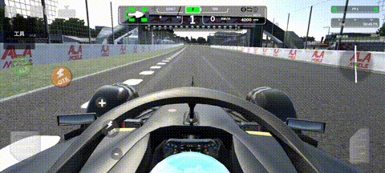
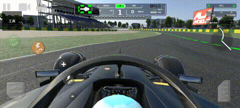

# Ala Mobile Tool

一个开源的 LSPosed 模块，用于增强 **Ala Mobile** 的操控体验。

> ⚠️ **仅供个人学习与研究使用**。本模块会修改游戏的运行时行为，在多人/在线模式下使用可能违反服务条款并导致封号。请仅在单机模式下使用。

## 演示

### 使用踏板覆盖

单击游戏内「工具」按钮打开 Overlay，使用线性踏板进行油门和刹车控制。



### 编辑 Overlay 布局

长按游戏内「工具」按钮进入编辑模式，拖动调整 Overlay 位置。



## 功能

### ✅ 已实现

- **踏板覆盖**：在屏幕上叠加线性踏板区域控制油门和刹车。支持三种拓扑——
  - **关闭**：不注入 overlay，使用游戏原始输入。
  - **单踏板**：单个区域，上半部分控制油门、下半部分控制刹车，支持死区、过渡点和响应曲线调节。
  - **双踏板**：油门和刹车各占一个独立区域，可分别拖动定位；带刹车过渡点和刹车优先仲裁（同时按下时屏蔽油门输入）。
- **响应曲线**：线性、指数两种映射，可调踏板手感。
- **踏板方向反转**：双踏板模式下，刹车踏板可选择从上往下生长（默认从下往上）。
- **主菜单音乐替换**：将游戏主菜单音乐替换为 Hans Zimmer - F1（320kbps），离开主菜单自动暂停/恢复。
- **多人模式 AI 车隔离**：模块输入只作用于玩家车（经 `IRDSPlayerControls` 天然过滤），不会误控 AI 赛车。
- **换挡按钮**：在屏幕左侧提供升档/降档按钮，用于手动换挡。开启手动换挡会同时禁用游戏的自动换挡。
- **布局编辑**：长按「工具」按钮进入编辑模式，拖动调整各 overlay 位置；长按编辑层按钮可重置到出厂默认位置。位置按 SINGLE/DUAL 分别持久化，互不串扰。
- **配置即时生效**：在模块设置界面修改配置后，游戏内 overlay 立即重建应用，无需重启游戏。
- **LSPosed 真激活检测**：概览页根据 LSPosed Manager 当前是否启用本模块实时显示激活状态（已激活/未激活）。
- **现代 UI**：采用 KernelSU 风格的三页布局（概览/配置/设置），支持深色模式，概览页内嵌 GitHub 与 QQ 群入口图标。

### 🚧 开发中

- **自动 DRS**：基于赛道 telemetry 自动判断 DRS 开启时机（当前仅拦截开关）。

## 已测试版本

| 版本 | versionCode | 架构 |
|---|---|---|
| 8.0.0 | 200142 | arm64-v8a |

其他版本请自行测试。IL2CPP 方法地址随版本变化，非 8.0.0 版本可能无法正确加载原生 hook。

## 安装

1. 确保手机已安装并启用 LSPosed（或兼容的 LSPosed 分支）框架。
2. 从 [Releases](https://github.com/TakotsuboChen/ala-mobile-tool/releases) 下载最新 APK。
3. 在 LSPosed 中勾选 **Ala Mobile** 作为作用域。
4. 启动游戏，进入游戏后点击左上角「工具」按钮显示 overlay。

> 首次启动游戏后建议先在模块设置界面中确认配置。

## 配置

在 LSPosed 模块列表中点击 **Ala Mobile Tool** 打开设置界面：

### 配置页

- **线性踏板**：踏板拓扑下拉——关闭 / 单踏板 / 双踏板。
- **显示悬浮窗**：是否显示踏板/换挡 overlay。
- **手动换挡**：开启后显示升档/降档按钮，并禁用游戏的自动换挡。
- **解锁付费内容**：解锁游戏内付费项。
- **替换主菜单音乐**：更改为 Hans Zimmer - F1（320kbps），开启后主菜单静音游戏原生音乐并循环播放替换曲。
- **自动 DRS**：自动 DRS 开关（功能开发中，当前默认关闭）。
- 单踏板模式下额外可调：
  - **死区**：踏板过渡区域附近的无效范围（0-20%），数值越小响应越灵敏。
  - **过渡点**：油门与刹车区域的分界线位置（20-80%）。
  - **响应曲线**：线性、指数两种映射。
- 双踏板模式下额外可调：
  - **刹车过渡点**：刹车优先仲裁的触发阈值（0-20%）。
  - **刹车踏板方向反转**：切换刹车红色区域的生长方向。

### 设置页

- **启用日志**：记录模块运行日志以便排查问题。
- **导出并分享日志**：导出当前日志文件。
- **清除激活标记**：删除 LSPosed 激活状态缓存。

## 已知问题

- 自动 DRS 仅拦截开关，尚未实现基于赛道 telemetry 的自动判断。
- **弯道"顿挫"通常来自游戏内置的刹车辅助**，与模块无关。请在游戏设置中关闭辅助功能。
- 共存版（重打包改包名）需配合双 ClassLoader 守卫与配置值坐标映射才能与原版行为一致，本版本已修复。

## 技术栈

- 现代 libxposed API 102
- Kotlin + Jetpack Compose + miuix
- ByteDance ShadowHook + IL2CPP inline hook
- Kotlin Multiplatform 支持

## 构建

需要 Android SDK（API 37）和 NDK r26c。

```bash
# 调试构建
./gradlew :app:assembleDebug

# 发布构建（需要配置签名）
./gradlew :app:assembleRelease
```

## 逆向工具

```bash
tools/run-il2cpp-dumper.sh
```

该脚本会调用 [Il2CppDumper](https://github.com/Perfare/Il2CppDumper) 生成 `il2cpp-dumps/v8.0.0/dump.cs`，随后需要手动提取目标方法/字段偏移并更新 `OffsetTable.kt`。

## 许可证

Apache-2.0

## 版本历史

- **v1.0.0 Beta 2** (2026-07-30)：踏板与配置体验大改。新增单/双踏板拓扑下拉、双踏板刹车优先仲裁与方向反转开关、长按重置出厂布局、SINGLE/DUAL 位置隔离持久化、配置即时生效（Remote Preferences 跨进程同步）；修复游戏自带方向键被模块 writer 持续清零导致的转向失灵；概览页激活卡片改为 KernelSU 风格对称配色，激活检测改用 LSPosed daemon 绑定状态，新增 GitHub/QQ 图标。
- **v1.0.0 Beta 1** (2026-07-29)：共存版稳定性大修。修复双 ClassLoader 注入导致的重复 hook/双 writer 线程；废除非原子的文件 IPC 路径，统一走 JNI 直调；用 rawY + 配置值坐标绕开 pairip 壳的 relayout 漂移。CI 自动构建 + tag 触发 Pre-release。
- **v1.0.0 Alpha 2** (2026-07-28)：UI 重构为 KernelSU 风格，修复多个编译错误，改进深色模式支持。
- **v1.0.0 Alpha 1** (2026-07-28)：初始发布，包含踏板覆盖、换挡按钮和基础 DRS 拦截功能。
