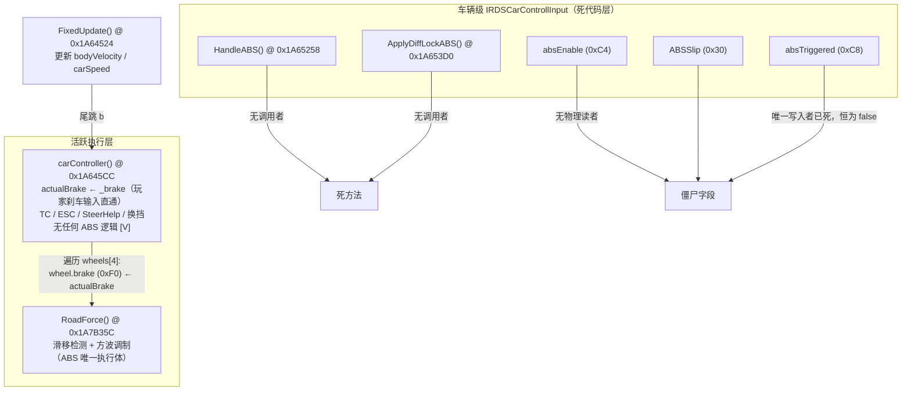
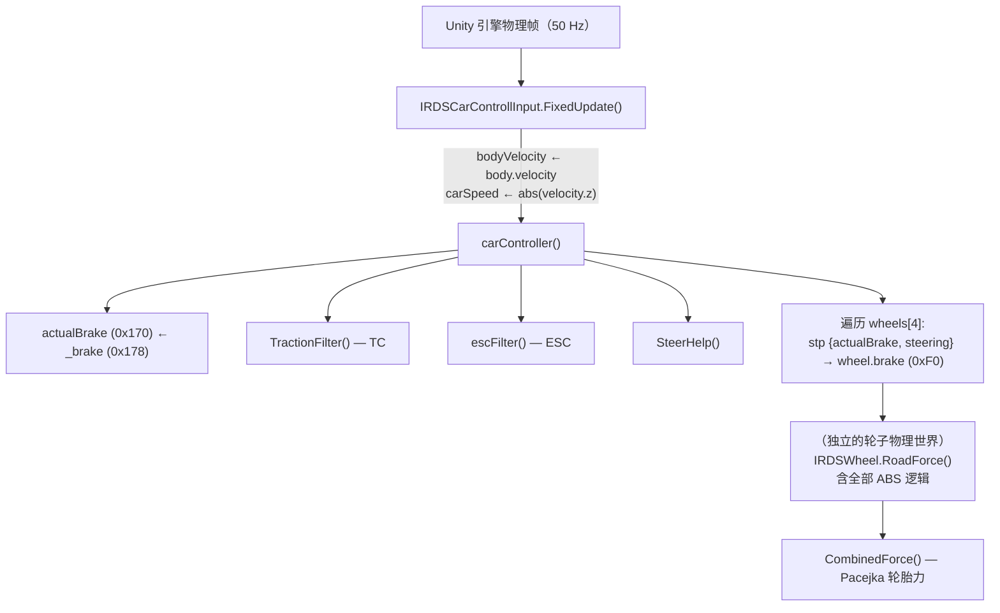
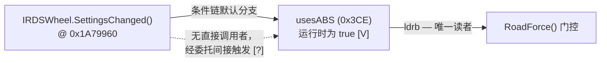
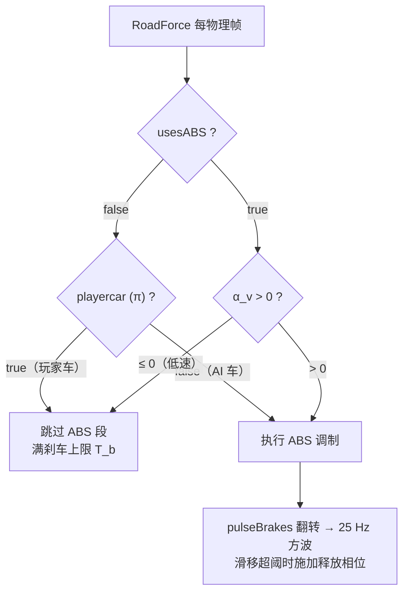
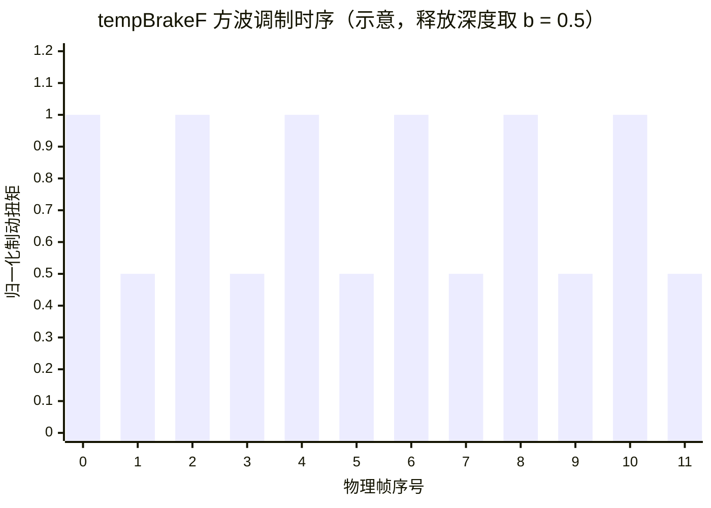
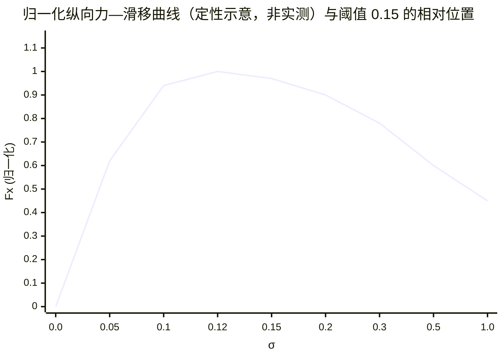
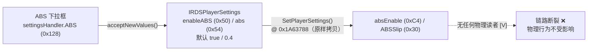
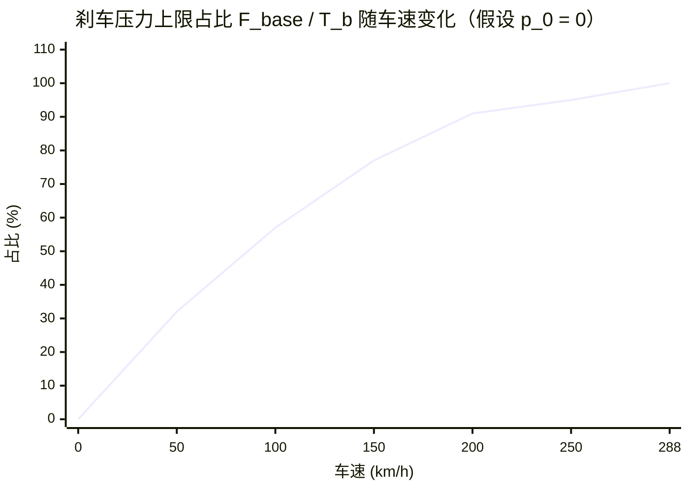

# Ala Mobile ABS 防抱死制动系统逆向分析

> 对 Ala Mobile（`com.Vince.AlamobileFormula`）车辆物理引擎中防抱死制动系统的逆向工程分析。
>
> 分析基于 IL2CPP dump（v8.0.4 / versionCode 200146）的字段布局与方法签名，
> 以及 **`libil2cpp.so` 的 ARM64 指令级反汇编**与模块原生钩子的运行时交叉验证。
>
> **版本适用性**：本文全部 RVA / 字段偏移 / 常数地址均为 8.0.4 (200146) 专属；
> 升级目标版本时须按 [附录 B](#附录-b方法可复现性说明) 重新验证。

---

## 目录

- [1. 引言](#1-引言)
- [2. 研究方法](#2-研究方法)
- [3. ABS 控制架构](#3-abs-控制架构)
- [4. ABS 控制律的形式化描述](#4-abs-控制律的形式化描述)
- [5. slipRatio 的语义分析](#5-slipratio-的语义分析)
- [6. 轮胎模型与 ABS 的解耦](#6-轮胎模型与-abs-的解耦)
- [7. 僵尸代码与僵尸字段清单](#7-僵尸代码与僵尸字段清单)
- [8. 玩家设置链的断裂分析](#8-玩家设置链的断裂分析)
- [9. 实际效果评估：贴极限与辅助过度](#9-实际效果评估贴极限与辅助过度)
- [10. 讨论：TC 与 ESC 的架构类比](#10-讨论tc-与-esc-的架构类比)
- [11. 结论](#11-结论)
- [附录 A：证据置信度矩阵](#附录-a证据置信度矩阵)
- [附录 B：关键常数与地址表](#附录-b关键常数与地址表)

---

## 1. 引言

### 1.1 研究对象与动机

游戏物理基于第三方 Unity 车辆物理库 **IRDS Car Physics**（`IRDS*` 命名空间），
游戏作者在其之上进行了深度修改。本文回答两个核心问题：

1. 该游戏的 ABS 在运行时**由哪段代码、以何种算法执行**；
2. 该算法的**实际控制效果**——是帮助玩家将轮胎滑移维持在最大抓地力极限
   （理想滑移伺服），还是存在显著的抓地力冗余（辅助过度）。

### 1.2 符号约定

| 符号 | 字段（偏移） | 含义 |
|---|---|---|
| $T_b$ | `brakeFrictionTorque` (0x88) | 制动摩擦扭矩上限 |
| $p_{\mathrm{brake}}$ | `wheel.brake` (0xF0) | 车辆级刹车输入，$\in[0,1]$ |
| $\sigma$ | `slipRatio` (0x104) | 归一化接地点滑动速度（§5） |
| $\alpha$ | `slipAngle` (0x170) | 侧偏角 |
| $\alpha_{\max}$ | `maxAngle` (0x1AC) | 峰值侧偏角 |
| $s_{\max}$ | `maxSlip` (0x1A8) | 动态峰值滑移（仅视觉/声音使用） |
| $b$ | `rawBrakeBiasValue` (0x3E0) | 制动偏置（序列化值） |
| $p_0$ | `legacyLowBrakePressureF/R` (0x3E4/0x3E8) | 低速压力下限（序列化值） |
| $s_{\mathrm{ABS}}$ | `usesABS` (0x3CE) | per-wheel ABS 门控 |
| $\pi$ | `carModifier.playercar` (0x9C) | 玩家车标志 |
| $\lambda$ | `ABSSlip` (0x30) | ABS 容差因子（死字段） |
| $k_P$ | `kP` (0x40C) | 连续衰减增益（恒为 0） |
| $\Delta t$ | — | 物理帧时长 $= 1/50\,\mathrm{s}$ |

### 1.3 证据分级

- **[V]** — 已验证：ARM64 反汇编指令级证据，或原生钩子的运行时验证；
- **[?]** — 推断：基于字段名与类型，未经反汇编确认；
- **[X]** — 已证伪：与反汇编证据直接矛盾。

---

## 2. 研究方法

### 2.1 静态分析流水线

1. 从游戏 APK 提取 `libil2cpp.so`（arm64-v8a）；
2. 以 Il2CppDumper 输出（`dump.cs`、`script.json`）获取类型布局与方法地址表
   （该 so 中 RVA $=$ VA $=$ 文件偏移）；
3. 使用 `llvm-objdump`（NDK 26.1.10909125）按地址区间反汇编目标方法；
4. 解析 ELF program header 将 VA 映射到文件偏移，读取 `.rodata` 浮点常数池；
5. 对全文件执行**指令级扫描**（见 §2.2）定位字段访问与调用关系。

### 2.2 指令级扫描技术

全文件（60 MB）按 4 字节对齐枚举机器字并解码：

- **调用图重建**：枚举所有 `bl`（操作码 `100101`）与 `b`（`000101`）指令，
  解码 26 位有符号立即数得到跳转目标，用以**证明某方法无调用者**（死方法）；
- **偏移访问扫描**：枚举所有无符号立即数偏移的 `ldr`/`str`/`ldrb`/`strb`/`ldp`
  及 `add imm12` 指令，解码立即数并与字段偏移匹配，定位**字段的全部读者与写入者**；
  注意掩码须覆盖 SIMD 与字节访问编码（`0xBD40xxxx` / `0x394F3A68` 等），
  否则会系统性漏报 `ldrb`/`strb`（本文初版即因掩码遗漏 `0x39` 编码组而误判 `usesABS` 无读者）；
- **常数提取**：经 ELF program header 将 VA 映射到文件偏移后读取 `.rodata` 浮点池。

### 2.3 交叉验证

静态结论与以下两类运行时证据交叉验证：
(a) 模块原生钩子的 logcat 触发记录；(b) 用户实测（关闭 ABS 后车轮抱死现象）。
二者与静态结论一致的部分标注 [V]。

---

## 3. ABS 控制架构

### 3.1 核心发现：车辆级 ABS 是死代码

游戏在库的原始设计中保留了完整的车辆级 ABS
（`IRDSCarControllInput.HandleABS()` 与 `absEnable`/`ABSSlip`/`absTriggered` 字段簇），
但**该层级在运行时从未执行**。唯一活跃的 ABS 实现位于轮子物理的
`IRDSWheel.RoadForce()` 中。



### 3.2 死代码判定方法

对整个 `libil2cpp.so`（60 MB）枚举全部 ARM64 `bl`/`b` 指令并解码跳转目标：

| 检索目标 | 命中数 | 结论 |
|---|---|---|
| 跳转至 `HandleABS` (0x1A65258) | **0** | 死方法 [V] |
| 跳转至 `ApplyDiffLockABS` (0x1A653D0) | **0** | 死方法 [V] |
| IRDS 物理类代码中访问 `absEnable` (0xC4) | 0（除 `HandleABS` 自身） | 僵尸字段 [V] |
| 写入 `absTriggered` (0xC8) | 0 | 恒为 false [V] |
| 访问 `brakeReducerMultiplier` (0x388) | 0 | 死字段 [V] |
| 写入 `kP` (0x40C) | 0 | 恒为 0 [V] |

值得强调的是前版分析的错误归因：**“HandleABS 被编译器内联至 carController”不成立**。
反汇编表明 `carController` 不含任何 ABS 逻辑（无 `slipRatio`、`maxSlip`、`usesABS` 访问）；
`HandleABS` 拥有完整的方法体却无调用者——hook 从不触发的真实原因是
IL2CPP 保留死方法体，而非内联。

### 3.3 调用链



关键结构事实 [V]：`FixedUpdate` 以**尾跳**（`b 0x1A645CC`）进入 `carController`，
这解释了二者 RVA 差值恒为 0xA8 的现象；`carController` 将车辆级刹车输入
（$p_{\mathrm{brake}} \in [0,1]$）广播至四轮，随后**每轮独立**在 `RoadForce` 中执行 ABS 调制。

### 3.4 `usesABS`：唯一活跃门控及其写入路径



`SettingsChanged` 的判定逻辑 [V]：读某静态单例链
（`[static+0xB8] → obj`），当 `[obj+0xA0] == NULL`、或 `[obj+0xA0]+0x74 ≠ 1`、
或 `[obj+0xB8]+0x48 == 0` 时写 `usesABS = true`；仅三者同时不满足才写 `false`。
由“模块将 `usesABS` 置 false 后玩家车 ABS 立即消失”的实测 [V] 反推：
运行时玩家车 `usesABS` 必为 `true`，即默认分支。该方法的触发时机（委托/事件）未验证 [?]。

---

## 4. ABS 控制律的形式化描述

以下全部来自 `RoadForce`（0x1A7B35C–0x1A7BE44，约 700 条指令）的逐行反汇编解读 [V]。

### 4.1 门控条件

设 $\alpha_v$ 为速度因子（§4.2），则 ABS 调制段被激活当且仅当：

$$
\text{active} \;\Longleftrightarrow\;
\bigl(s_{\mathrm{ABS}} \;\wedge\; \alpha_v > 0\bigr)
\;\vee\;
\bigl(\neg s_{\mathrm{ABS}} \;\wedge\; \neg\pi \;\wedge\; \alpha_v > 0\bigr)
$$

即：玩家车（$\pi = \text{true}$）必须 $s_{\mathrm{ABS}} = \text{true}$；
AI 车无视 `usesABS` 强制参与。



### 4.2 速度因子

$$
\alpha_v \;=\; \operatorname{clamp}_{[0,1]}\!\left(\frac{\lVert\mathbf{v}\rVert - v_{\mathrm{low}}}{v_{\mathrm{full}} - v_{\mathrm{low}}}\right)
\;=\; \operatorname{clamp}_{[0,1]}\!\left(\frac{\lVert\mathbf{v}\rVert}{13.89}\right)
$$

其中 $v_{\mathrm{low}} = 0$（`lowAbsDisableSpeed`，无写入者）、$v_{\mathrm{full}} = 13.89\,\mathrm{m/s}$
（`fullAbsEnableSpeed`，构造函数常数 0x415E3D71）。
即 50 km/h 以上 ABS 满强度，低于此速度按比例线性减弱 [V]。

### 4.3 组合摩擦圆权重（侧向让渡）

$$
\gamma = \operatorname{clamp}_{[0,1]}\!\left(1 - \frac{|\alpha|}{\alpha_{\max}}\right),
\qquad
\beta = \operatorname{clamp}_{[0,1]}\!\left(\frac{b}{0.3}\right),
\qquad
\Omega = \gamma + \beta\,(1-\gamma)
$$

其中 $\gamma$ 度量侧向余量（侧偏角越接近峰值，纵向可用余量越少），
$\beta$ 为以硬编码常数 $0.3$ 归一化的制动偏置因子。
该权重实现**组合滑移管理**：侧滑增大时主动让渡纵向刹车力给侧向抓地，
属于对摩擦圆的合理利用而非冗余。

### 4.4 速度相关的刹车压力上限

$$
r = \operatorname{clamp}_{[0,1]}\!\left(\frac{\lVert\mathbf{v}\rVert}{80}\right)
\quad (80 = \texttt{tempRearBrakeBalancerSpeed},\ \text{ctor 默认})
$$

$$
p_{\mathrm{lim}} = p_0 + r\,(T_b - p_0)
$$

$$
F_{\mathrm{base}} \;=\; p_{\mathrm{lim}} + r\,(T_b - p_{\mathrm{lim}})
\;=\; p_0 + (2r - r^2)\,(T_b - p_0)
$$

即两段线性插值逼近满压上限。$r \to 1$（$\ge 80\,\mathrm{m/s}$）时 $F_{\mathrm{base}} \to T_b$；
低速时 $F_{\mathrm{base}}$ 显著低于 $T_b$。
$p_0$ 取驱动轮的 `legacyLowBrakePressureRear` 或非驱动轮的 `legacyLowBrakePressureFront`。

### 4.5 脉冲方波与滑移调制

`pulseBrakes` (0x408) 在 ABS 段内**每帧无条件翻转**
（`ldrb` → `eor w8, w8, #1` → `strb`），在 50 Hz 物理帧下构成 **25 Hz 方波、50% 占空比**。

$$
T \;=\;
\begin{cases}
F_{\mathrm{base}}\,\Omega, & |\sigma| \le 0.15 \\[4pt]
F_{\mathrm{base}}\,\Omega\cdot b, & |\sigma| > 0.15 \;\wedge\; \text{pulse} \\[4pt]
F_{\mathrm{base}}\,\Omega\cdot\Bigl(1 - \alpha_v\,\kappa\,k_P\,\bigl(|\sigma| - 0.15\bigr)\,\Delta t\Bigr), & |\sigma| > 0.15 \;\wedge\; \neg\,\text{pulse}
\end{cases}
$$

其中 $\kappa$ 为驱动轮偏置派生因子（$s_8$），且 $k_P \equiv 0$（无写入者，§3.1），
故第三分支恒等于 $F_{\mathrm{base}}\,\Omega$——**非释放相位不存在连续比例抑制**。



最终制动扭矩合成：

$$
\tau_{\mathrm{brake}} \;=\; T \cdot p_{\mathrm{brake}}
\qquad\text{（无 ABS 路径： } \tau_0 = T_b\cdot p_{\mathrm{brake}}\text{）}
$$

### 4.6 控制律汇总

```text
输入: p_brake (车辆刹车输入), σ, α, ‖v‖, pulse 状态
输出: τ_brake

1  T_temp ← T_b                          # 满刹车扭矩上限
2  p_brake' ← p_brake
3  α_v ← clamp01(‖v‖ / 13.89)
4  if ¬active(§4.1) then τ ← T_temp · p_brake; return
5  r       ← clamp01(‖v‖ / 80)
6  Ω      ← γ + β(1 − γ)                  # §4.3
7  F_base ← p_0 + (2r − r²)(T_b − p_0)    # §4.4
8  pulse  ← ¬pulse
9  if |σ| > 0.15 then
10      if pulse then T ← F_base·Ω·b
11      else          T ← F_base·Ω·(1 − α_v·κ·k_P·(|σ|−0.15)·Δt)   # k_P ≡ 0
12  else T ← F_base·Ω
13  return τ_brake ← T · p_brake
```

---

## 5. slipRatio 的语义分析

来自 `IRDSWheel.SlipRatio()`（0x1A7B244）的反汇编：

$$
\sigma \;=\;
\frac{-v_{L,z}}{\max\bigl(\lVert\mathbf{w}\rVert,\,1\bigr)}
\;\cdot\;
\operatorname{clamp}_{[0,1]}\!\left(\frac{c\,\bigl|v_{\mathrm{local},z}\bigr|}{8\,\Delta t}\right),
\qquad c = 0.02,\;\; \Delta t = \tfrac{1}{50}
$$

- $v_L$（0x24C）：接地点相对地面的局部滑动速度（自由滚动 $\approx 0$，锁死 $\approx -\lVert\mathbf{v}\rVert$）；
- $\lVert\mathbf{w}\rVert$ 为轮速矢量模长（参数），低速由 $\max(\cdot, 1)$ 兜底；
- 低速衰减因子 $\operatorname{clamp}_{[0,1]}(|v_{\mathrm{local},z}|\cdot 0.125)$：$v_{\mathrm{local},z} < 8\,\mathrm{m/s}$ 时按比例压缩 $\sigma$，抑制低速误触发。

**语义**：$\sigma$ 是归一化的接地点滑动速度——完全锁死时 $\approx 1.0$，自由滚动时为 0。
它与经典滑移率 $(\omega r - v)/v$ 同向不同式，但数量级等效：
**阈值常数 $0.15$ 等效于经典滑移率约 15%**。

---

## 6. 轮胎模型与 ABS 的解耦

### 6.1 Pacejka 轮胎力模型

`IRDSWheel` 持有 `a[]`(0xB0)、`b[]`（0xC8）、`cCoefficients`（0xE0）系数组，
配合 `PseudoAtan`（0x1A7D91C）实现 Pacejka 魔术公式：

$$
F_x \;=\; D\,\sin\!\Bigl(C\,\arctan\!\bigl(B\,\sigma - E\,\bigl(B\,\sigma - \arctan(B\,\sigma)\bigr)\bigr)\Bigr)
$$

相关方法：`CalcLongitudinalForce`（0x1A78EC0）、`CalcLateralForce`（0x1A79050）、
`CombinedForce`（0x1A79314）、`InitSlipMaxima`（0x1A796CC）、`UpdateMaxSlips`（0x1A7D020）。

### 6.2 `maxSlip` 动态峰值系统及其用途边界

`InitSlipMaxima` 构建 100 点"载重 → 峰值滑移"查找表（`slipR[]`/`slipA[]`，0x2A0/0x2A8），
`UpdateMaxSlips` 依据当前 `normalForce` 插值更新 $s_{\max}$。

然而对 $s_{\max}$ (0x1A8) 的**全部读者**扫描结果为：

| 读者 | 用途 |
|---|---|
| `IRDSCarVisuals.TireModelVisuals` 等 | 打滑烟尘、轮胎形变视觉 |
| `IRDSSoundController`（`CreateTireBumpSound` 等） | 打滑 / ABS 音效 |
| `InGameUIManager` 等 | UI |

**没有任何 ABS 控制代码读取 $s_{\max}$**——轮胎模型的动态峰值与 ABS 完全解耦 [V]。
ABS 使用的是与工况无关的编译期常数 $0.15$。
二者仅在"典型工况"下数值巧合地接近；载荷/胎温偏移时，ABS 工作点将系统性偏离真实峰值。



示意曲线的峰值置于 $\sigma \approx 0.12$：阈值 $0.15$ 位于**峰后下降段**——
ABS 介入时轮胎通常已经越过峰值，控制器通过方波将滑移拉回，而非将工作点伺服锁定于峰值。

---

## 7. 僵尸代码与僵尸字段

以下均经全文件指令级扫描确认 [V]：

| 名称 | 位置 | 状态 | 证据 |
|---|---|---|---|
| `HandleABS()` | 0x1A65258 | 死方法 | 全文件 bl/b 扫描 0 命中；模块钩子从不触发 |
| `ApplyDiffLockABS()` | 0x1A653D0 | 死方法 | 全文件 bl/b 扫描 0 命中（差速锁 ABS 未实现于运行时） |
| `absEnable` (0xC4) | CarControllInput | 无物理读者 | 仅死代码读取 |
| `ABSSlip` (0x30) | CarControllInput | 无物理读者 | `IRDSAerodynamicResistance.Execute` 调 `SetABSSlip` 写入，写入无效 |
| `absTriggered` (0xC8) | CarControllInput | 恒 false | 唯一写入者已死；`RoadForce` 读取它决定轮速积分分支（恒走积分路径） |
| `brakeReducerMultiplier` (0x388) | IRDSWheel | 死字段 | 全文件零访问 |
| `kP` (0x40C) | IRDSWheel | 恒 0 | 有读取（`RoadForce`）无写入，§4.5 第三分支因此退化为恒等 |

---

## 8. 玩家设置链的断裂



每一传播环节均已验证：`acceptNewValues`（0x1A26A4C）写入设置对象；
`SetPlayerSettings`（0x1A63788）将 `abs` 原样拷贝至 `ABSSlip`（`str s0`，无变换）；
但两个终点字段在物理层**无读者**。**结论：游戏设置菜单中的 ABS 开关与等级
对物理行为无效**（仅可能影响 UI 的 ABS 指示灯 [?]）。物理 ABS 对玩家车永远处于
开启状态（`usesABS = true`），除非像模块一样直接改写轮子的 `usesABS`。

---

## 9. 实际效果评估：贴极限与辅助过度

### 9.1 与理想滑移伺服的偏差来源

理想的极限刹车是**滑移伺服**：将滑移率连续稳定于 Pacejka 峰值 $s_{\max}$。
本实现的偏差来自三点：

1. **无滑移闭环**：$k_P \equiv 0$，非释放相位不存在连续比例抑制 [V]。
   控制器只有"全力 / $\times b$"两个状态，工作点在阈值两侧**极限环振荡**而非稳定于峰值；
2. **阈值固定、与 $s_{\max}$ 解耦** [V]：峰值随载荷与胎温漂移，阈值恒为 0.15；
3. **方波振荡的固有损失**：释放相位制动扭矩乘 $b$，稳态平均

$$
\bar{\tau}_{\mathrm{ABS}} \;=\; \frac{1+b}{2}\; F_{\mathrm{base}}\,\Omega\,p_{\mathrm{brake}}
$$

（$b$ 为序列化值，具体数值未知 [?]；若 $b=0.5$ 则平均约 75%，若 $b \to 0$ 则 50%。）

### 9.2 冗余的定量分解

压力上限模型（§4.4）在 $p_0 = 0$ 假设下的归一化占比：

$$
\frac{F_{\mathrm{base}} - p_0}{T_b - p_0} \;=\; 2r - r^2,
\qquad
r = \operatorname{clamp}_{[0,1]}\!\left(\frac{\lVert\mathbf{v}\rVert}{80}\right)
$$



关键事实：**只要门控激活（$s_{\mathrm{ABS}}$ 且 $\|\mathbf{v}\| > 0$），
$T$ 即被重算为 $F_{\mathrm{base}}\Omega \le T_b$——与轮胎是否打滑无关** [V]。
真实 ABS 在低速时几乎不干预（低速车轮不易抱死），而此实现把"低速限压"做成
**无条件的压力上限**：50 km/h 时上限仅为满压的 ~32%（若 $p_0 \approx 0$），
且该削减不依赖任何打滑证据。这是抓地力冗余的最大来源。

按影响排序的冗余来源分解：

| 来源 | 机制 | 定性量级 |
|---|---|---|
| 低速压力上限 | $F_{\mathrm{base}} = p_0 + (2r - r^2)(T_b - p_0)$，$r = \lVert\mathbf{v}\rVert/80$ | 低速区（$< 100\,$km/h）最为显著 [V] |
| 方波占空比 | 25 Hz 方波，释放相位 $\times\, b$ | 平均力 $\times\,(1+b)/2$ [V] |
| 侧向让渡 | $\Omega = \gamma + \beta(1-\gamma)$ | 合理设计（摩擦圆组合滑移管理），不计为冗余 |
| 无连续伺服 | $k_P \equiv 0$ | 非 pulse 相位无衰减项 [V] |

### 9.3 防锁死有效性

实测证据 [V]：开启 ABS 重刹车轮不抱死、车辆保持可控；关闭后车轮立即抱死。
机制自洽：释放相位每 40 ms 强制出现一次，车轮获得恢复转速的机会，
滑动速度不会无限增大——以制动距离换取**转向能力**（侧偏角可控），
与真实 ABS 的核心价值一致。

### 9.4 结论

> Ala Mobile 的 ABS **不是将滑移伺服于最大抓地力点的控制器**，
> 而是"检测到滑动（$|\sigma| > 0.15$）即以 25 Hz 方波间歇泄压"的防锁死器。
> 其阈值恰位于典型峰值滑移附近，但执行方式粗糙（两态方波、$k_P = 0$、无峰值反馈），
> 叠加低速段与打滑无关的强力限压，
> **综合抓地力冗余显著，且集中于 100 km/h 以下的制动区**。
> 它交换的是防抱死与转向保持，而非最短制动距离。

---

## 10. 讨论：TC 与 ESC 的架构类比

| 系统 | 车辆级开关 | 触发标志 | 阈值/因子 | 真实执行体 | 状态 |
|---|---|---|---|---|---|
| ABS | `absEnable` (0xC4) **[死]** | `absTriggered` (0xC8) **[恒 false]** | 硬编码 0.15 + `usesABS` | `RoadForce` 内联 | 轮子级活跃 [V] |
| TC | `tclEnable` (0xC6) | `tclTriggered` (0xCA) | `TCLSlip` (0x34) | `TractionFilter(accel)` @ 0x1A64CE4 | 未被内联，hook 有效 [V] |
| ESC | `escEnable` (0xC5) | `escTriggered` (0xC9) | `escFactor` (0x3C) | `escFilter()` @ 0x1A65090 | 活跃 |

TC/ESC 未在本文范围内做同等深度反汇编；其车辆级开关是否同样断裂待查 [?]。

---

## 11. 结论

1. 该游戏的 ABS 在**车辆级**（`HandleABS`/`absEnable`/`ABSSlip`/`absTriggered`）已整体废弃，
   运行时唯一实现位于**轮子级** `IRDSWheel.RoadForce`，由 per-wheel `usesABS` 门控；
2. 控制律为：速度因子门控 → 速度相关两段插值压力上限 → 摩擦圆让渡权重 →
   **25 Hz 方波**在滑移阈值 $0.15$（硬编码常数）上方间歇释放，$k_P = 0$，无连续伺服；
3. 阈值与动态轮胎峰值 $s_{\max}$ **解耦**（后者仅服务视觉/声音）；
4. 玩家设置链在最后一个环节断裂——游戏内 ABS 开关对物理无效；
5. 综合评估：**防锁死优先、抓地力冗余显著**（低速限压 + 方波占空比 + 无伺服三重来源），
   代价是制动距离，收益是防抱死与转向保持。

---

## 附录 A：证据置信度矩阵

| 发现 | 置信度 | 证据来源 |
|---|---|---|
| `HandleABS` / `ApplyDiffLockABS` 为死方法 | [V] | 全文件 bl/b 解码扫描 0 命中 + proxy hook 无日志 |
| `carController` 不含 ABS 逻辑 | [V] | 反汇编全文检索 |
| `FixedUpdate` 尾跳 `carController` | [V] | `b 0x1A645CC` |
| `RoadForce` 是 ABS 唯一执行体 | [V] | `usesABS`/`pulseBrakes`/`kP`/速度因子/阈值全部在此访问 |
| `usesABS` 为唯一 per-wheel 门控 | [V] | 全文件扫描：仅 `SettingsChanged` 写、`RoadForce` 读 |
| `usesABS=false` 且 `playercar` → 跳过 ABS | [V] | 反汇编分支 + 实测禁用生效 |
| 滑移阈值 0.15 硬编码 | [V] | `.rodata` 0x929A54 $= -0.15$ |
| `pulseBrakes` 每帧翻转（25 Hz 方波） | [V] | `eor w8, w8, #1` + `strb` |
| pulse 相位 $\times b$ | [V] | 反汇编分支 |
| $k_P \equiv 0$ | [V] | 全文件无写入 |
| 速度因子 $\alpha_v = \operatorname{clamp}(\lVert v\rVert/13.89)$ | [V] | ctor 默认 13.89 / 0 |
| 压力上限两段插值 | [V] | `F_base = p_0 + (2r−r²)(T_b−p_0)` |
| $\sigma$ 为归一化滑动速度 | [V] | `SlipRatio` 反汇编 |
| $s_{\max}$ 仅用于视觉/声音 | [V] | 全文件读者扫描 |
| 玩家设置链断裂 | [V] | `acceptNewValues → SetPlayerSettings →` 死字段 |
| `abs` 默认值 0.4 | [V] | `IRDSPlayerSettings..ctor`（0x3ECCCCCD） |
| `SettingsChanged` 触发时机 | [?] | 无直接调用者，间接调用路径未验证 |
| $b$、`legacyLowBrakePressure*` 实际值 | [?] | Unity 序列化资产，静态分析不可得 |
| 80（限压分母）的单位 | [?] | m/s 假设（Rigidbody.velocity 原始单位） |
| TC/ESC 车辆级开关的有效性 | [?] | 未做同等深度反汇编 |
| ~~HandleABS 被内联至 carController~~ | [X] | carController 反汇编无 ABS 逻辑；HandleABS 有完整方法体、无调用者 |
| ~~ABSSlip 为滑移率阈值~~ | [X] | 系（死设计中的）容差因子，且无读者 |
| ~~阈值定义于 Pacejka 峰值附近（动态）~~ | [X] | 真实阈值硬编码 0.15，与轮胎曲线解耦 |
| ~~`brakeReducerMultiplier` 渐进控制~~ | [X] | 死字段 |
| ~~速度区间线性渐进启用 ABS~~ | [X] | 修正为 $\alpha_v$ 门控（0 / 13.89）与另一路压力限值 |

## 附录 B：关键常数与地址表

| 名称 | 值 / 地址 | 出处 |
|---|---|---|
| 滑移阈值 | $0.15$（`.rodata` @ 0x929A54，存储为 $-0.15$） | [V] |
| 滑移归一化斜率 $c$ | 0.02（`.rodata` @ 0x929B70） | [V] |
| 偏置归一化除数 | 0.3（`.rodata` @ 0x929EAC） | [V] |
| `fullAbsEnableSpeed` | 13.89 m/s（0x415E3D71，ctor @ 0x1A7DCA8） | [V] |
| `lowAbsDisableSpeed` | 0（无写入者） | [V] |
| `tempRearBrakeBalancerSpeed` | 80.0（ctor） | [V] |
| 死设计车速门槛 | 15.0 m/s（`HandleABS` 内硬编码） | [V，死代码] |
| `IRDSPlayerSettings.abs` 默认值 | 0.4（ctor @ 0x199DD78） | [V] |
| 压力平滑常数 | 0.15（`.rodata` @ 0x9297B4） | [V] |
| 角度→弧度 | $\pi/180$（`.rodata` @ 0x929A14） | [V] |