# Ala Mobile 技术解析

> 对 Ala Mobile（`com.Vince.AlamobileFormula`）游戏引擎各子系统的逆向工程分析，
> 涵盖车辆动力学、空气动力学、驾驶辅助系统（ABS/TC/ESC）、DRS 等。
>
> 分析基于 IL2CPP dump（v8.0.4 / versionCode 200146）的字段布局与方法签名，
> 以及 **`libil2cpp.so` 的 ARM64 指令级反汇编**与模块原生钩子的运行时交叉验证。
>
> **文档范围**：本文按子系统分篇，随逆向进度陆续补充。
> 篇章编号按成篇追加顺序分配（详见总目录），当前已完成 ABS 篇与
> 车辆动力学（TC / ESC / 转向辅助）篇；
> 空气动力学与 DRS、传动与多线程轮子物理等为规划中的占位篇目（见各篇导语）。
>
> **版本适用性**：本文全部 RVA / 字段偏移 / 常数地址均为 8.0.4 (200146) 专属；
> 升级目标版本时须按各篇验证清单重新验证。

---

## 总目录

> 篇章编号按**成篇追加顺序**分配（共享方法篇固定为 §1），不预设规划篇章的编号与顺序；
> 新篇章完成后追加于文末并取下一个可用编号，已有篇章编号不变。

- **共享方法篇**：[1　研究方法与证据体系](#1研究方法与证据体系)
- **已完成**：
  - [2　ABS 防抱死制动系统](#2abs-防抱死制动系统)
  - [3　车辆动力学：TC / ESC / 转向辅助](#3车辆动力学tc--esc--转向辅助)
- **规划中**（顺序与编号待成篇时确定）：
  - 空气动力学与 DRS
  - 传动与多线程轮子物理
- **附录**：[A　ABS 篇证据置信度矩阵](#附录-aabs-篇证据置信度矩阵) · [B　ABS 篇关键常数与地址表](#附录-babs-篇关键常数与地址表) · [C　TC/ESC 篇证据置信度矩阵](#附录-ctcesc-篇证据置信度矩阵) · [D　TC/ESC 篇关键常数与地址表](#附录-dtcesc-篇关键常数与地址表)

---

# 1　研究方法与证据体系

> 本部分为全部篇章共享的方法论。各篇结论的可信度判定均以此为准。

## 1.1 数据来源与工具链

1. 从游戏 APK 提取 `libil2cpp.so`（arm64-v8a）；
2. 以 Il2CppDumper 输出（`dump.cs`、`script.json`）获取类型布局与方法地址表
   （该 so 中 RVA = VA；代码段文件偏移 = VA − 0x4000，`.rodata` 段 VA = 文件偏移，
   两者不可混用——全文件调用图扫描必须统一到同一地址域，否则系统性零命中）；
3. 使用 `llvm-objdump`（NDK 26.1.10909125）按地址区间反汇编目标方法；
4. 解析 ELF program header 将 VA 映射到文件偏移，读取 `.rodata` 浮点常数池。

## 1.2 指令级扫描技术

对全文件（60 MB）按 4 字节对齐枚举机器字并解码：

- **调用图重建**：枚举所有 `bl`（操作码 `100101`）与 `b`（`000101`）指令，
  解码 26 位有符号立即数得到跳转目标，用以**证明某方法无调用者**（死方法）；
- **偏移访问扫描**：枚举所有无符号立即数偏移的 `ldr`/`str`/`ldrb`/`strb`/`ldp`
  及 `add imm12` 指令，解码立即数并与字段偏移匹配，定位**字段的全部读者与写入者**；
  掩码须覆盖 SIMD 与字节访问编码（`0xBD40xxxx` / `0x394F3A68` 等），
  否则会系统性漏报 `ldrb`/`strb`（初版扫描曾因掩码遗漏 `0x39` 编码组而误判 `usesABS` 无读者）；
- **常数提取**：经 ELF program header 将 VA 映射到文件偏移后读取 `.rodata` 浮点池。

## 1.3 证据分级

- **[V]** — 已验证：ARM64 反汇编指令级证据，或原生钩子的运行时验证；
- **[?]** — 推断：基于字段名与类型，未经反汇编确认；
- **[X]** — 已证伪：与反汇编证据直接矛盾。

交叉验证来源：(a) 模块原生钩子的 logcat 触发记录；(b) 用户实测现象。
静态结论与二者一致的部分标注 [V]。

---

# 2　ABS 防抱死制动系统

> 本篇回答两个问题：该游戏的 ABS 在运行时**由哪段代码、以何种算法执行**；
> 该算法的**实际控制效果**——是帮助玩家将轮胎滑移维持在最大抓地力极限
> （理想滑移伺服），还是存在显著的抓地力冗余（辅助过度）。

## 2.1 符号约定

| 符号 | 字段（偏移） | 含义 |
|---|---|---|
| $`T_b`$ | `brakeFrictionTorque` (0x88) | 制动摩擦扭矩上限 |
| $`p_{\mathrm{brake}}`$ | `wheel.brake` (0xF0) | 车辆级刹车输入，$`\in[0,1]`$ |
| $`\sigma`$ | `slipRatio` (0x104) | 归一化接地点滑动速度（§2.4） |
| $`\alpha`$ | `slipAngle` (0x170) | 侧偏角 |
| $`\alpha_{\max}`$ | `maxAngle` (0x1AC) | 峰值侧偏角 |
| $`s_{\max}`$ | `maxSlip` (0x1A8) | 动态峰值滑移（仅视觉/声音使用） |
| $`b`$ | `rawBrakeBiasValue` (0x3E0) | 制动偏置（序列化值） |
| $`p_0`$ | `legacyLowBrakePressureF/R` (0x3E4/0x3E8) | 低速压力下限（序列化值） |
| $`s_{\mathrm{ABS}}`$ | `usesABS` (0x3CE) | per-wheel ABS 门控 |
| $`\pi`$ | `carModifier.playercar` (0x9C) | 玩家车标志 |
| $`\lambda`$ | `ABSSlip` (0x30) | ABS 容差因子（死字段） |
| $`k_P`$ | `kP` (0x40C) | 连续衰减增益（恒为 0） |
| $`\Delta t`$ | — | 物理帧时长 $`= 1/50\,\mathrm{s}`$ |

## 2.2 ABS 控制架构

### 2.2.1 核心发现：车辆级 ABS 是死代码

游戏物理基于第三方 Unity 车辆物理库 **IRDS Car Physics**（`IRDS*` 命名空间），
游戏作者在其之上进行了深度修改。库的原始设计保留了完整的车辆级 ABS
（`IRDSCarControllInput.HandleABS()` 与 `absEnable`/`ABSSlip`/`absTriggered` 字段簇），
但**该层级在运行时从未执行**。唯一活跃的 ABS 实现位于轮子物理的
`IRDSWheel.RoadForce()` 中。

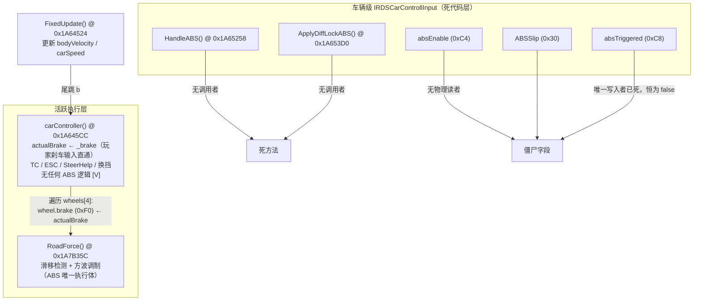

### 2.2.2 死代码判定方法

对整个 `libil2cpp.so`（60 MB）枚举全部 ARM64 `bl`/`b` 指令并解码跳转目标（§1.2）：

| 检索目标 | 命中数 | 结论 |
|---|---|---|
| 跳转至 `HandleABS` (0x1A65258) | **0** | 死方法 [V] |
| 跳转至 `ApplyDiffLockABS` (0x1A653D0) | **0** | 死方法 [V] |
| IRDS 物理类代码中访问 `absEnable` (0xC4) | 0（除 `HandleABS` 自身） | 僵尸字段 [V] |
| 写入 `absTriggered` (0xC8) | 0 | 恒为 false [V] |
| 访问 `brakeReducerMultiplier` (0x388) | 0 | 死字段 [V] |
| 写入 `kP` (0x40C) | 0 | 恒为 0 [V] |

值得强调的是早期分析的错误归因：**"HandleABS 被编译器内联至 carController"不成立**。
反汇编表明 `carController` 不含任何 ABS 逻辑（无 `slipRatio`、`maxSlip`、`usesABS` 访问）；
`HandleABS` 拥有完整的方法体却无调用者——hook 从不触发的真实原因是
IL2CPP 保留死方法体，而非内联。

死代码判定的工作流（可复现，方法细节见第一部分 §1.2）：

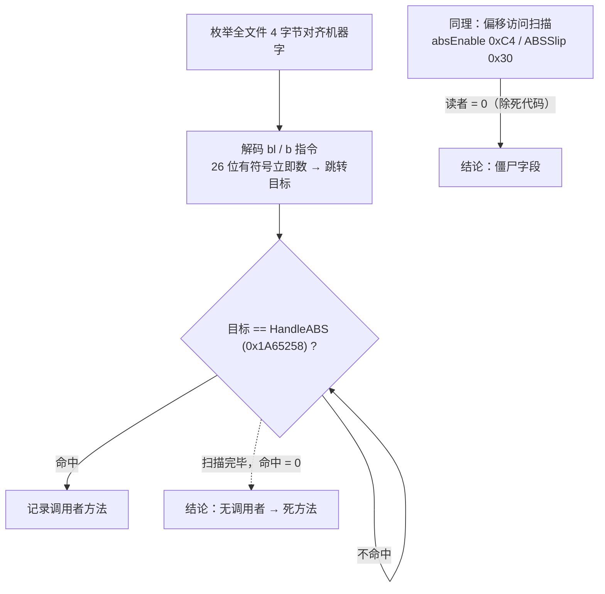

### 2.2.3 调用链

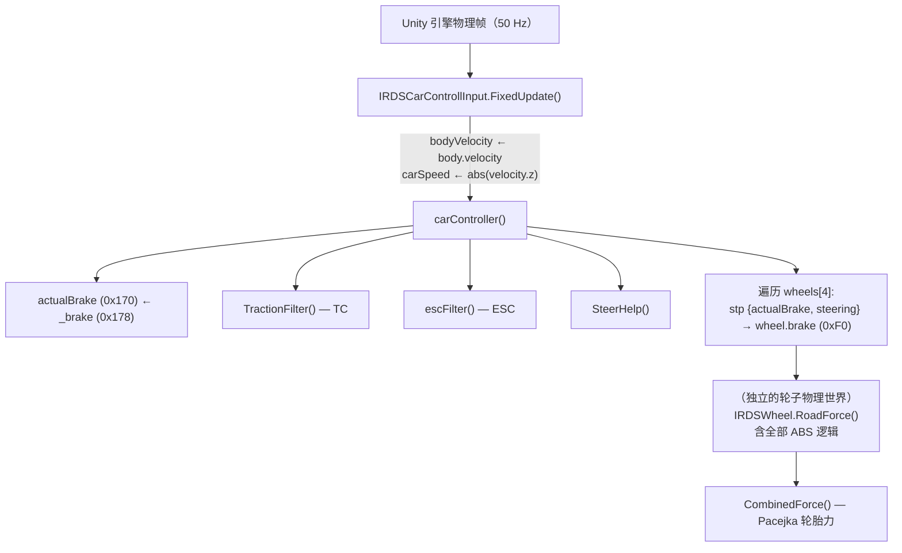

关键结构事实 [V]：`FixedUpdate` 以**尾跳**（`b 0x1A645CC`）进入 `carController`，
这解释了二者 RVA 差值恒为 0xA8 的现象；`carController` 将车辆级刹车输入
（$`p_{\mathrm{brake}} \in [0,1]`$）广播至四轮，随后**每轮独立**在 `RoadForce` 中执行 ABS 调制。

单个物理帧（20 ms）内的执行时序：

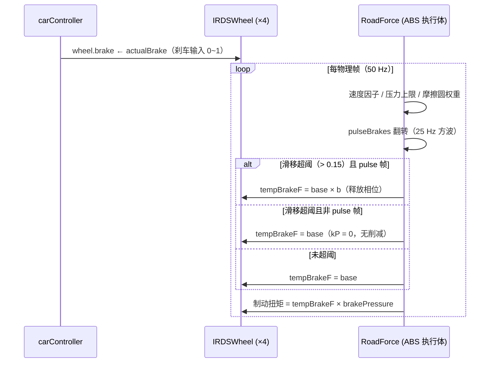

### 2.2.4 `usesABS`：唯一活跃门控及其写入路径

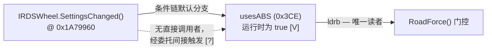

`SettingsChanged` 的判定逻辑 [V]：读某静态单例链
（`[static+0xB8] → obj`），当 `[obj+0xA0] == NULL`、或 `[obj+0xA0]+0x74 ≠ 1`、
或 `[obj+0xB8]+0x48 == 0` 时写 `usesABS = true`；仅三者同时不满足才写 `false`。
由"模块将 `usesABS` 置 false 后玩家车 ABS 立即消失"的实测 [V] 反推：
运行时玩家车 `usesABS` 必为 `true`，即默认分支。该方法的触发时机（委托/事件）未验证 [?]。

## 2.3 ABS 控制律的形式化描述

以下全部来自 `RoadForce`（0x1A7B35C–0x1A7BE44，约 700 条指令）的逐行反汇编解读 [V]。

控制信号的完整数据流（各符号定义见 §2.1）：

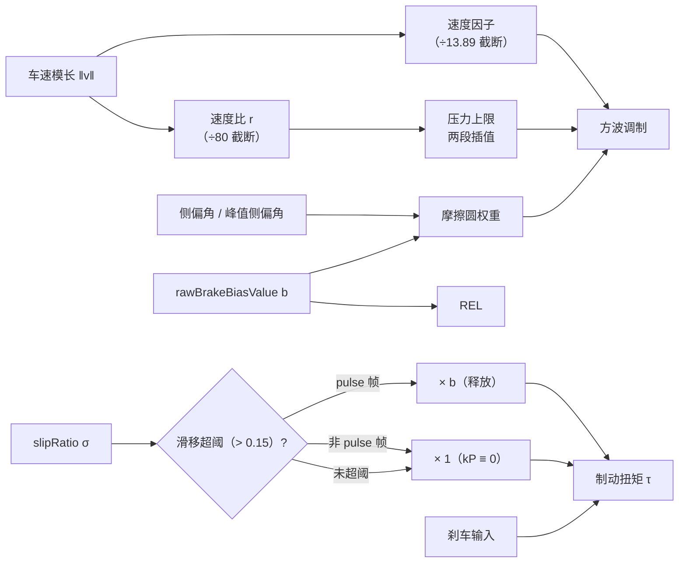

### 2.3.1 门控条件

设 $`\alpha_v`$ 为速度因子（§2.3.2），则 ABS 调制段被激活当且仅当：

```math
\text{active} \;\Longleftrightarrow\;
\bigl(s_{\mathrm{ABS}} \;\wedge\; \alpha_v > 0\bigr)
\;\vee\;
\bigl(\neg s_{\mathrm{ABS}} \;\wedge\; \neg\pi \;\wedge\; \alpha_v > 0\bigr)
```

即：玩家车（$`\pi = \text{true}`$）必须 $`s_{\mathrm{ABS}} = \text{true}`$；
AI 车无视 `usesABS` 强制参与。

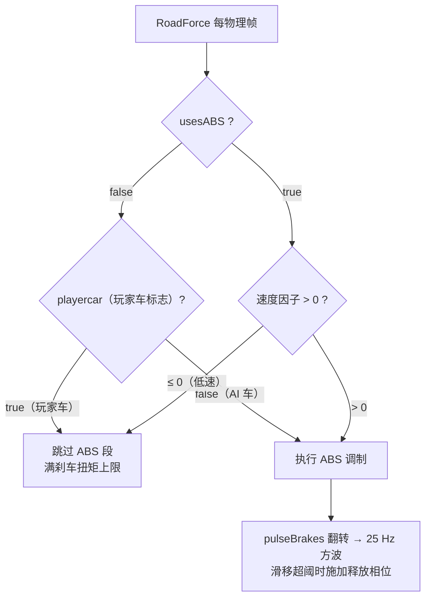

`pulseBrakes` 的两态状态机（翻转由物理帧驱动，无任何条件分支）：

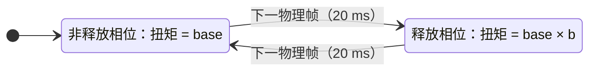

### 2.3.2 速度因子

```math
\alpha_v \;=\; \mathrm{clamp}_{[0,1]}\!\left(\frac{\lVert\mathbf{v}\rVert - v_{\mathrm{low}}}{v_{\mathrm{full}} - v_{\mathrm{low}}}\right)
\;=\; \mathrm{clamp}_{[0,1]}\!\left(\frac{\lVert\mathbf{v}\rVert}{13.89}\right)
```

其中 $`v_{\mathrm{low}} = 0`$（`lowAbsDisableSpeed`，无写入者）、$`v_{\mathrm{full}} = 13.89\,\mathrm{m/s}`$
（`fullAbsEnableSpeed`，构造函数常数 0x415E3D71）。
即 50 km/h 以上 ABS 满强度，低于此速度按比例线性减弱 [V]。

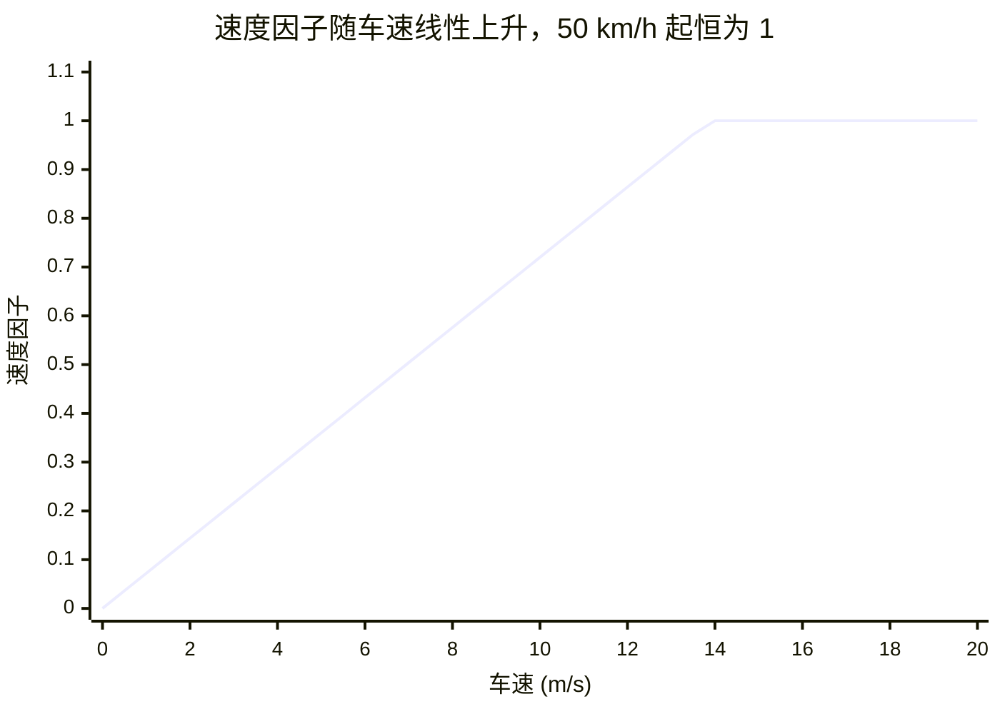

### 2.3.3 组合摩擦圆权重（侧向让渡）

```math
\gamma = \mathrm{clamp}_{[0,1]}\!\left(1 - \frac{|\alpha|}{\alpha_{\max}}\right),
\qquad
\beta = \mathrm{clamp}_{[0,1]}\!\left(\frac{b}{0.3}\right),
\qquad
\Omega = \gamma + \beta\,(1-\gamma)
```

其中 $`\gamma`$ 度量侧向余量（侧偏角越接近峰值，纵向可用余量越少），
$`\beta`$ 为以硬编码常数 $`0.3`$ 归一化的制动偏置因子。
该权重实现**组合滑移管理**：侧滑增大时主动让渡纵向刹车力给侧向抓地，
属于对摩擦圆的合理利用而非冗余。

### 2.3.4 速度相关的刹车压力上限

```math
r = \mathrm{clamp}_{[0,1]}\!\left(\frac{\lVert\mathbf{v}\rVert}{80}\right)
```

其中 $`80`$ 为 `tempRearBrakeBalancerSpeed` 的构造函数默认值。

```math
p_{\mathrm{lim}} = p_0 + r\,(T_b - p_0)
```

```math
F_{\mathrm{base}} \;=\; p_{\mathrm{lim}} + r\,(T_b - p_{\mathrm{lim}})
\;=\; p_0 + (2r - r^2)\,(T_b - p_0)
```

即两段线性插值逼近满压上限。$`r \to 1`$（$`\ge 80\,\mathrm{m/s}`$）时 $`F_{\mathrm{base}} \to T_b`$；
低速时 $`F_{\mathrm{base}}`$ 显著低于 $`T_b`$。
$`p_0`$ 取驱动轮的 `legacyLowBrakePressureRear` 或非驱动轮的 `legacyLowBrakePressureFront`。

### 2.3.5 脉冲方波与滑移调制

`pulseBrakes` (0x408) 在 ABS 段内**每帧无条件翻转**
（`ldrb` → `eor w8, w8, #1` → `strb`），在 50 Hz 物理帧下构成 **25 Hz 方波、50% 占空比**。

```math
T \;=\;
\begin{cases}
F_{\mathrm{base}}\,\Omega, & |\sigma| \le 0.15 \\[4pt]
F_{\mathrm{base}}\,\Omega\cdot b, & |\sigma| > 0.15 \;\wedge\; \text{pulse} \\[4pt]
F_{\mathrm{base}}\,\Omega\cdot\Bigl(1 - \alpha_v\,\kappa\,k_P\,\bigl(|\sigma| - 0.15\bigr)\,\Delta t\Bigr), & |\sigma| > 0.15 \;\wedge\; \neg\,\text{pulse}
\end{cases}
```

其中 $`\kappa`$ 为驱动轮偏置派生因子（$`s_8`$），且 $`k_P \equiv 0`$（无写入者，§2.2.2），
故第三分支恒等于 $`F_{\mathrm{base}}\,\Omega`$——**非释放相位不存在连续比例抑制**。

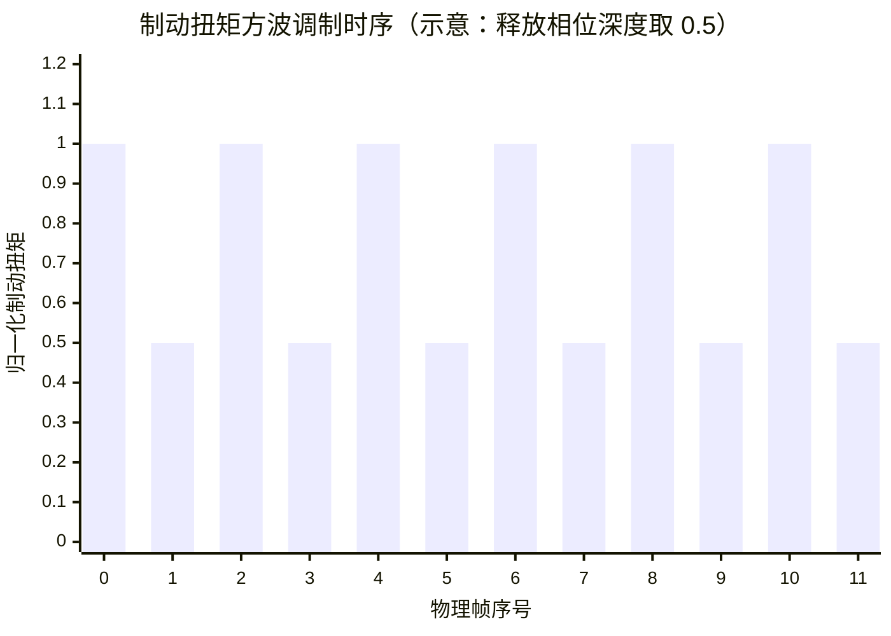

最终制动扭矩合成：

```math
\tau_{\mathrm{brake}} \;=\; T \cdot p_{\mathrm{brake}}
```

无 ABS 路径下为 $`\tau_0 = T_b \cdot p_{\mathrm{brake}}`$。

### 2.3.6 控制律汇总

```text
输入: p_brake (车辆刹车输入), σ, α, ‖v‖, pulse 状态
输出: τ_brake

1  T_temp ← T_b                          # 满刹车扭矩上限
2  α_v ← clamp01(‖v‖ / 13.89)
3  if ¬active(§2.3.1) then τ ← T_temp · p_brake; return
4  r      ← clamp01(‖v‖ / 80)
5  Ω      ← γ + β(1 − γ)                  # §2.3.3
6  F_base ← p_0 + (2r − r²)(T_b − p_0)    # §2.3.4
7  pulse  ← ¬pulse
8  if |σ| > 0.15 then
9      if pulse then T ← F_base·Ω·b
10     else          T ← F_base·Ω·(1 − α_v·κ·k_P·(|σ|−0.15)·Δt)   # k_P ≡ 0
11 else T ← F_base·Ω
12 return τ_brake ← T · p_brake
```

## 2.4 slipRatio 的语义分析

来自 `IRDSWheel.SlipRatio()`（0x1A7B244）的反汇编：

```math
\sigma \;=\;
\frac{-v_{L,z}}{\max\bigl(\lVert\mathbf{w}\rVert,\,1\bigr)}
\;\cdot\;
\mathrm{clamp}_{[0,1]}\!\left(\frac{c\,\bigl|v_{\mathrm{local},z}\bigr|}{8\,\Delta t}\right),
\qquad c = 0.02,\;\; \Delta t = \tfrac{1}{50}
```

- $`v_L`$（0x24C）：接地点相对地面的局部滑动速度（自由滚动 $`\approx 0`$，锁死 $`\approx -\lVert\mathbf{v}\rVert`$）；
- $`\lVert\mathbf{w}\rVert`$ 为轮速矢量模长（参数），低速由 $`\max(\cdot, 1)`$ 兜底；
- 低速衰减因子 $`\mathrm{clamp}_{[0,1]}(|v_{\mathrm{local},z}|\cdot 0.125)`$：$`v_{\mathrm{local},z} < 8\,\mathrm{m/s}`$ 时按比例压缩 $`\sigma`$，抑制低速误触发。

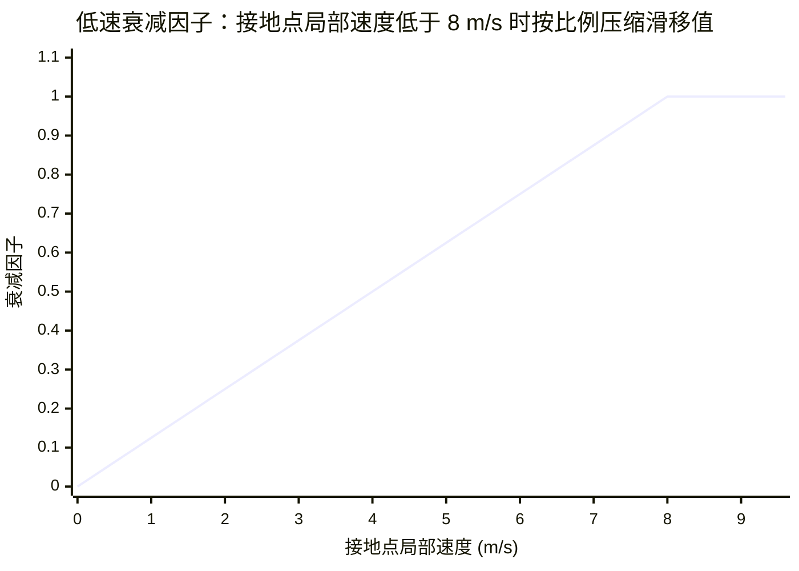

**语义**：$`\sigma`$ 是归一化的接地点滑动速度——完全锁死时 $`\approx 1.0`$，自由滚动时为 0。
它与经典滑移率 $`(\omega r - v)/v`$ 同向不同式，但数量级等效：
**阈值常数 $`0.15`$ 等效于经典滑移率约 15%**。

## 2.5 轮胎模型与 ABS 的解耦

### 2.5.1 Pacejka 轮胎力模型

`IRDSWheel` 持有 `a[]`(0xB0)、`b[]`（0xC8）、`cCoefficients`（0xE0）系数组，
配合 `PseudoAtan`（0x1A7D91C）实现 Pacejka 魔术公式：

```math
F_x \;=\; D\,\sin\!\Bigl(C\,\arctan\!\bigl(B\,\sigma - E\,\bigl(B\,\sigma - \arctan(B\,\sigma)\bigr)\bigr)\Bigr)
```

相关方法：`CalcLongitudinalForce`（0x1A78EC0）、`CalcLateralForce`（0x1A79050）、
`CombinedForce`（0x1A79314）、`InitSlipMaxima`（0x1A796CC）、`UpdateMaxSlips`（0x1A7D020）。

### 2.5.2 `maxSlip` 动态峰值系统及其用途边界

`InitSlipMaxima` 构建 100 点"载重 → 峰值滑移"查找表（`slipR[]`/`slipA[]`，0x2A0/0x2A8），
`UpdateMaxSlips` 依据当前 `normalForce` 插值更新 $`s_{\max}`$。

然而对 $`s_{\max}`$ (0x1A8) 的**全部读者**扫描结果为：

| 读者 | 用途 |
|---|---|
| `IRDSCarVisuals.TireModelVisuals` 等 | 打滑烟尘、轮胎形变视觉 |
| `IRDSSoundController`（`CreateTireBumpSound` 等） | 打滑 / ABS 音效 |
| `InGameUIManager` 等 | UI |

**没有任何 ABS 控制代码读取 $`s_{\max}`$**——轮胎模型的动态峰值与 ABS 完全解耦 [V]。
ABS 使用的是与工况无关的编译期常数 $`0.15`$。
二者仅在"典型工况"下数值巧合地接近；载荷/胎温偏移时，ABS 工作点将系统性偏离真实峰值。

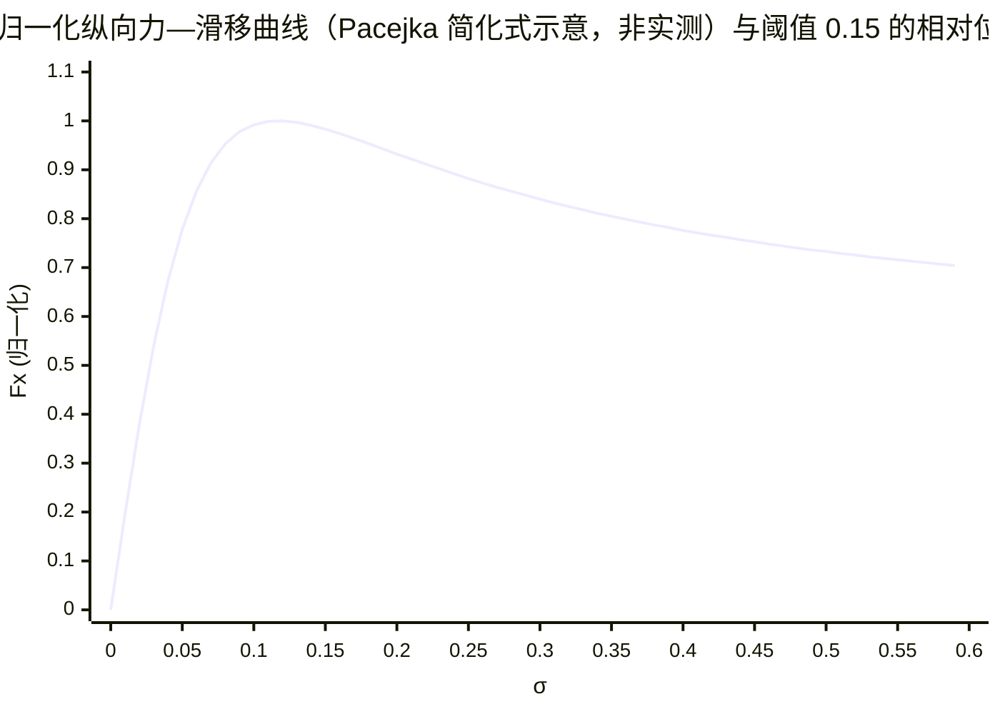

示意曲线的峰值置于 $`\sigma \approx 0.12`$：阈值 $`0.15`$ 位于**峰后下降段**——
ABS 介入时轮胎通常已经越过峰值，控制器通过方波将滑移拉回，而非将工作点伺服锁定于峰值。

## 2.6 僵尸代码与僵尸字段

以下均经全文件指令级扫描确认 [V]：

| 名称 | 位置 | 状态 | 证据 |
|---|---|---|---|
| `HandleABS()` | 0x1A65258 | 死方法 | 全文件 bl/b 扫描 0 命中；模块钩子从不触发 |
| `ApplyDiffLockABS()` | 0x1A653D0 | 死方法 | 全文件 bl/b 扫描 0 命中（差速锁 ABS 未实现于运行时） |
| `absEnable` (0xC4) | CarControllInput | 无物理读者 | 仅死代码读取 |
| `ABSSlip` (0x30) | CarControllInput | 无物理读者 | `IRDSAerodynamicResistance.Execute` 调 `SetABSSlip` 写入，写入无效 |
| `absTriggered` (0xC8) | CarControllInput | 恒 false | 唯一写入者已死；`RoadForce` 读取它决定轮速积分分支（恒走积分路径） |
| `brakeReducerMultiplier` (0x388) | IRDSWheel | 死字段 | 全文件零访问 |
| `kP` (0x40C) | IRDSWheel | 恒 0 | 有读取（`RoadForce`）无写入，§2.3.5 第三分支因此退化为恒等 |

## 2.7 玩家设置链的断裂

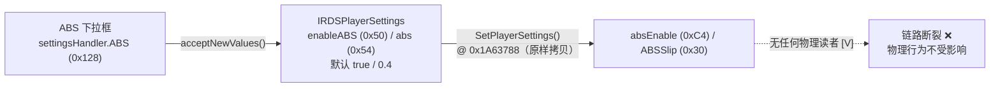

每一传播环节均已验证：`acceptNewValues`（0x1A26A4C）写入设置对象；
`SetPlayerSettings`（0x1A63788）将 `abs` 原样拷贝至 `ABSSlip`（`str s0`，无变换）；
但两个终点字段在物理层**无读者**。**结论：游戏设置菜单中的 ABS 开关与等级
对物理行为无效**（仅可能影响 UI 的 ABS 指示灯 [?]）。物理 ABS 对玩家车永远处于
开启状态（`usesABS = true`），除非像模块一样直接改写轮子的 `usesABS`。

## 2.8 实际效果评估：贴极限与辅助过度

### 2.8.1 与理想滑移伺服的偏差来源

理想的极限刹车是**滑移伺服**：将滑移率连续稳定于 Pacejka 峰值 $`s_{\max}`$。
本实现的偏差来自三点：

1. **无滑移闭环**：$`k_P \equiv 0`$，非释放相位不存在连续比例抑制 [V]。
   控制器只有"全力 / $`\times b`$"两个状态，工作点在阈值两侧**极限环振荡**而非稳定于峰值；
2. **阈值固定、与 $`s_{\max}`$ 解耦** [V]：峰值随载荷与胎温漂移，阈值恒为 0.15；
3. **方波振荡的固有损失**：释放相位制动扭矩乘 $`b`$，稳态平均

```math
\bar{\tau}_{\mathrm{ABS}} \;=\; \frac{1+b}{2}\; F_{\mathrm{base}}\,\Omega\,p_{\mathrm{brake}}
```

（~~$`b`$ 为序列化值，具体数值未知~~ **2026-08-28 运行时实测定案 [V]：$`b = 0`$**（默认配平 $`\mathrm{bias}=60`$，见 §2.8.2 修正块）——pulse 帧完全泄压，方波平均恰为 50%。）

### 2.8.2 冗余的定量分解

压力上限模型（§2.3.4）在 $`p_0 = 0`$ 假设下的归一化占比：

```math
\frac{F_{\mathrm{base}} - p_0}{T_b - p_0} \;=\; 2r - r^2,
\qquad
r = \mathrm{clamp}_{[0,1]}\!\left(\frac{\lVert\mathbf{v}\rVert}{80}\right)
```

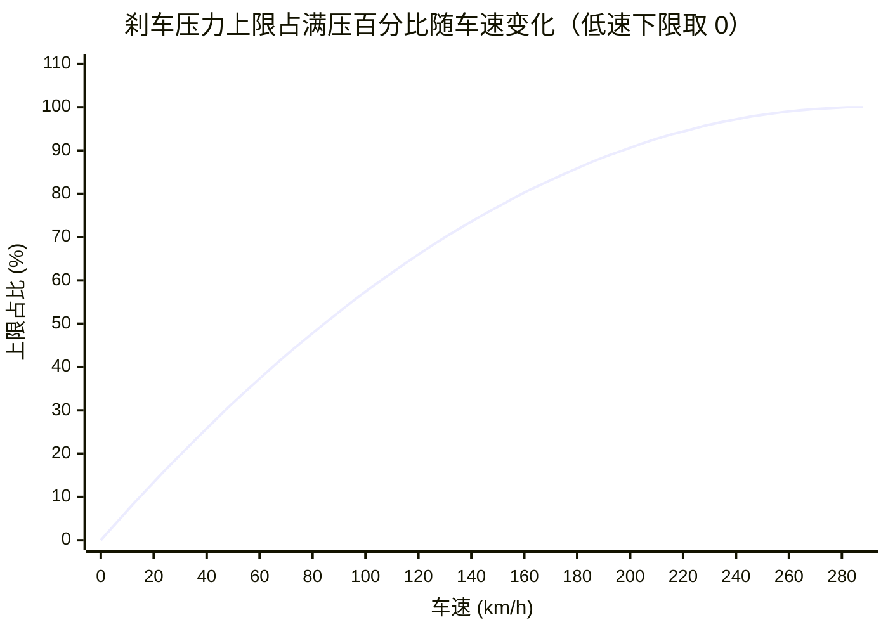

该曲线是抛物线 $`2r - r^2`$（$`r`$ 为速度比）：50 km/h 处仅 32%、100 km/h 处 57%——
**制动区前半段的刹车压力被压到满压的一半以下，且与轮子是否打滑无关**。

以 50 km/h 工况为例（假设低速下限为零、释放深度 0.5、摩擦圆权重为 1），
ABS 激活期间平均可用的制动扭矩相对满压的构成：

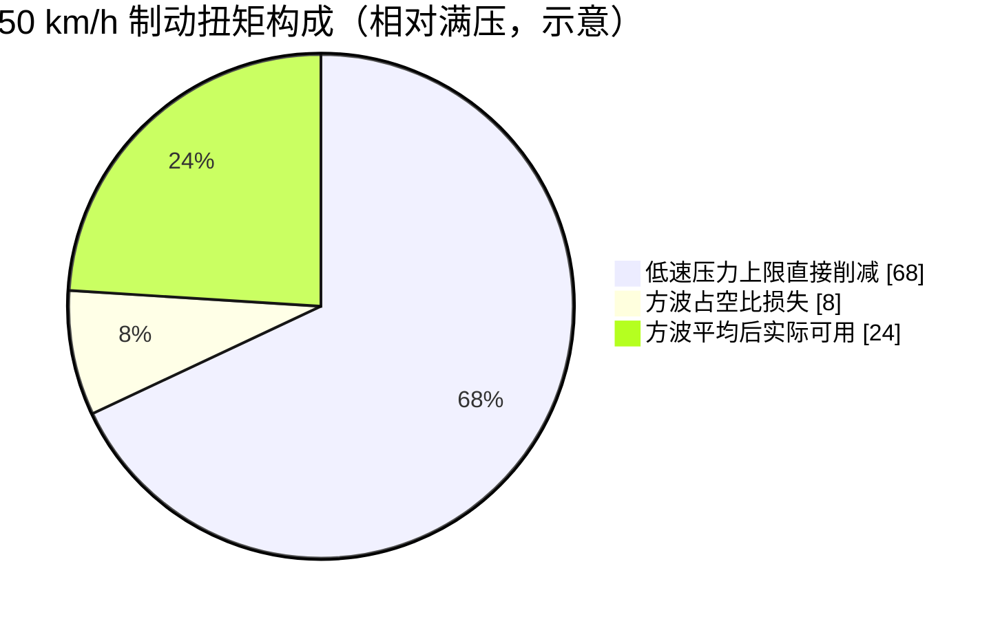

关键事实：**只要门控激活（$`s_{\mathrm{ABS}}`$ 且 $`\|\mathbf{v}\| > 0`$），
$`T`$ 即被重算为 $`F_{\mathrm{base}}\Omega \le T_b`$——与轮胎是否打滑无关** [V]。
真实 ABS 在低速时几乎不干预（低速车轮不易抱死），而此实现把"低速限压"做成
**无条件的压力上限**：50 km/h 时上限仅为满压的 ~32%（若 $`p_0 \approx 0`$），
且该削减不依赖任何打滑证据。

> **2026-08-28 运行时实测修正（模块 ABSdiag + 档位功能实装）**——上述"低速限压
> 是最大冗余来源"的归因**仅成立于低速段**，全段视角下已证伪并修正：
>
> 1. **$`b = 0`$ 实测定案**：`SetBrakeBiasValues`（0x1762BF4）完整计算式破解——
>    $`T_b`$ 前轮 $`= 75.0 \times \mathrm{bias}`$、后轮 $`= 75.0 \times (100-\mathrm{bias})`$；
>    $`b`$ 前轮 $`= \mathrm{clamp}_{[0,1]}((\mathrm{bias}-60)/10)\times 0.3`$（后轮对称）；
>    默认 $`\mathrm{bias}=60`$（中点）$`\Rightarrow`$ **前后轮 $`b`$ 全为 0**。
>    ABSdiag 运行时读回：$`T_b = 4500/3000`$（前/后，即 75×60 / 75×40）[V]、
>    $`b = 0.000`$ [V]——与计算式逐位吻合。
> 2. **$`p_0`$ 对高速段无贡献**：$`F_{\mathrm{base}} = p_0(1-r)^2 + (2r-r^2)T_b`$，
>    $`p_0`$ 权重 $`(1-r)^2`$ 高速趋零（150 km/h 仅 0.23）——"低速限压"不是
>    全段冗余的来源。
> 3. **全段过度保护的主因是 $`b=0`$ 方波泄压**：pulse 帧 $`T\times 0`$ 完全泄压，
>    方波在 $`[F_{\mathrm{base}}\Omega,\ 0]`$ 振荡，平均 $`0.5\,F_{\mathrm{base}}\Omega`$。
>    实测对照（用户）：开 ABS 打滑中平均 $`0.32\text{–}0.45\,T_b`$（100–250 km/h），
>    关 ABS 为 $`1.0\,T_b`$——**2.2–3 倍差距**，与"开 ABS 全段几乎不锁死 /
>    关 ABS 秒锁死"体感精确吻合 [V]。
> 4. **$`\sigma`$ 不是进出段条件**：进段由 usesABS/αv 决定，玩家车运动中
>    恒在 ABS 段内；$`|\sigma|>0.15`$（唯一比较点 0x1A7B760 fcmp/b.le）仅
>    切换"满压 $`F_{\mathrm{base}}\Omega`$ ↔ 泄压 $`\times b`$"相位 [V]。
>    pulse 相位乘法后**无任何二次 clamp**（0x1A7B7DC 直接 str）[V]。
> 5. **模块侧杠杆（v2 档位架构，2026-08-28 实装）**：针对上述冗余来源，模块提供
>    两组正交旋钮——**干预强度**（绝对值覆写 per-wheel $`b`$，抬高方波平均缓解
>    "全段过度保护"）与**最大制动压力**（等比缩放 $`T_b`$，修"关 ABS 秒锁死"的
>    制动基数，关闭 ABS 下亦生效）；关闭 ABS 走 per-wheel `usesABS=false` 双重
>    门控。档位模型与标定史见 `ABS_LEVEL_DESIGN.md`，工程实现见
>    `MODULE_ABS_NOTES.md` §2b。

按影响排序的冗余来源分解：

| 来源 | 机制 | 定性量级 |
|---|---|---|
| 低速压力上限 | $`F_{\mathrm{base}} = p_0 + (2r - r^2)(T_b - p_0)`$，$`r = \lVert\mathbf{v}\rVert/80`$ | 低速区（$`< 100\,`$km/h）最为显著 [V] |
| 方波占空比 | 25 Hz 方波，释放相位 $`\times\, b`$ | 平均力 $`\times\,(1+b)/2`$ [V] |
| 侧向让渡 | $`\Omega = \gamma + \beta(1-\gamma)`$ | 合理设计（摩擦圆组合滑移管理），不计为冗余 |
| 无连续伺服 | $`k_P \equiv 0`$ | 非 pulse 相位无衰减项 [V] |

### 2.8.3 防锁死有效性

实测证据 [V]：开启 ABS 重刹车轮不抱死、车辆保持可控；关闭后车轮立即抱死。
机制自洽：释放相位每 40 ms 强制出现一次，车轮获得恢复转速的机会，
滑动速度不会无限增大——以制动距离换取**转向能力**（侧偏角可控），
与真实 ABS 的核心价值一致。

### 2.8.4 本篇结论

> Ala Mobile 的 ABS **不是将滑移伺服于最大抓地力点的控制器**，
> 而是"检测到滑动（$`|\sigma| > 0.15`$）即以 25 Hz 方波间歇泄压"的防锁死器。
> 其阈值恰位于典型峰值滑移附近，但执行方式粗糙（两态方波、$`k_P = 0`$、无峰值反馈），
> **且默认配平下释放深度 $`b = 0`$（pulse 帧完全泄压），全速域平均压力
> 被压到 $`0.5\,F_{\mathrm{base}}\Omega \approx 0.32\text{–}0.45\,T_b`$**。
> ~~叠加低速段与打滑无关的强力限压，综合抓地力冗余显著，且集中于 100 km/h
> 以下的制动区~~（2026-08-28 实测修正：$`p_0`$ 限压只作用于低速段——其权重
> $`(1-r)^2`$ 高速趋零；全段冗余的主因是 $`b=0`$ 方波，见 §2.8.2 修正块）。
> 它交换的是防抱死与转向保持，而非最短制动距离。

---

# 空气动力学与 DRS（待补充）

> **占位篇目**——逆向进行中，本篇将覆盖：
> - `IRDSAerodynamicResistance`（空气阻力模型，含 `SetABSSlip` 的异常调用点，待查）
> - `IRDSWing`：升力/阻力系数（`liftCoefficient`、`dragCoefficient`、`drsLiftMultiplier`），
>   `SetDRSLiftReduction` / `ResetDRSLiftReduction` / `MountNewWing`
> - `IRDSCarControllInput.drsToggle()`（0x1A64CC8）与 DRS 区间判定
> - 模块已实现的 auto DRS hook（`native/src/drs_hook.c`）所对应的游戏侧逻辑

# 3　车辆动力学：TC / ESC / 转向辅助

> 本篇回答四个问题：牵引力控制（TC）的执行体、感知来源与完整控制律；
> TC 的玩家设置链是否像 ABS 一样断裂（§2.7）；以及共享同一条电控管线的
> 电子稳定程序（ESC）与转向辅助（SteerHelp）的实际机制。
> 结论先行：**车辆级 TC / ESC / SteerHelp 全部是活代码**，与 ABS 的"死车辆级层"形成对照；
> TC 的削减上限为 85%，全速域活跃（0~40 km/h 起步段被 $`v_0 = 11.0`$ m/s
> 门控豁免；"79 km/h 高速关闭"实为维修区限速逻辑，赛道上不生效，§3.10 勘误），
> ESC 以单侧后轮制动纠正横摆。ESC/SteerHelp 的玩家设置链完整有效，
> TC 的参数链有效但其开关位被每帧重算（§3.7、§3.10）。

## 3.1 符号约定

| 符号 | 字段（偏移） | 含义 |
|---|---|---|
| $`\tau`$ | `_inputTorque` (0x174) | 过滤前的油门扭矩输入，$`\in[0,1]`$ |
| $`\tau'`$ | `actualInputTorque` (0x16C) | TC 合成后的实际驱动扭矩输入 |
| $`\sigma`$ | `IRDSWheel.slipRatio` (0x104) | 驱动轮滑移率（由 `RoadForce` 计算） |
| $`\bar\sigma`$ | `IRDSDrivetrain.slipRatio` (0xCC) | 驱动轮滑移率的传动系加权聚合 |
| $`\alpha`$ | `slipAngle` (0x170) | 轮胎侧偏角 |
| $`s_{\max}`$ | `maxSlip` (0x1A8) | 每轮峰值滑移归一化上限 |
| $`\alpha_{\max}`$ | `maxAngle` (0x1AC) | 每轮峰值侧偏角上限 |
| $`W`$ | — | 综合滑移指标 $`= \max\bigl(\lvert\sigma/s_{\max}\rvert,\ \lvert\alpha/\alpha_{\max}\rvert\bigr)`$ |
| $`\varepsilon`$ | `TCLSlip` (0x34) | TC 阈值参数（ctor 0.45；**运行时实测 0.40**，见 §3.7 注） |
| $`v_0`$ | `TCLminSPD` (0x38) | TC 最低工作车速（ctor 1.0 m/s；**运行时实测 11.0 m/s**，见 §3.7 注） |
| $`g`$ | `drivetrain.gear` (0xC0) | 当前挡位（0 = 空挡） |
| $`t`$ | `tclEnable` (0xC6) | TCL 门控开关 |
| $`c_T`$ | `.rodata` 0x929E7C | TC 补偿系数 $`= -0.85`$ |
| $`\beta`$ | `driftAngle` (0x70) | 车体侧偏角（度） |
| $`f_E`$ | `escFactor` (0x3C) | ESC 制动强度（默认 1.0） |
| $`k_S`$ | `steerHelp` (0x40) | 转向辅助强度（默认 0.01） |
| $`\Delta t`$ | — | 物理帧时长 $`= 1/50\,\mathrm{s}`$ |
| $`\rho`$ | `brakeFrictionTorque` (0x88) | 制动摩擦扭矩上限 |

## 3.2 电控管线架构

与 ABS 的"车辆级死代码、轮级活代码"格局相反，TC / ESC / SteerHelp 的车辆级实现
**正是活跃执行层**。`carController()`（玩家物理主入口）以固定顺序串联三个过滤
阶段，全部位于 `IRDSCarControllInput` 内 [V]：

| 阶段 | 方法 | 地址 | 调用点（carController 内偏移） |
|---|---|---|---|
| 入口 | `FixedUpdate` → 尾跳 `carController` | 0x1A64524 / 0x1A645CC | `b 0x1A645C4` |
| TC | `TractionFilter(accel)` | 0x1A64CE4 | +0xBC |
| SteerHelp | `SteerHelp(steer)` | 0x1A64E28 | +0x470 |
| ESC | `escFilter()` | 0x1A65090 | +0x5BC |

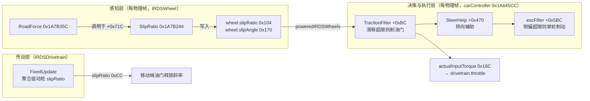

三个过滤器**共享同一组感知字段**：TractionFilter 读取每轮的 $`\sigma`$ 与 $`\alpha`$，
SteerHelp 读取每轮的归一化量 `unitSlip`/`unitAngle`（0x3F8/0x3FC），
escFilter 读取车体速度合成的侧偏角 $`\beta`$。三者的门控位与触发位在
`IRDSCarControllInput` 中连续排布（0xC4–0xC7 与 0xC8–0xCB 各四字节）[V]。

## 3.3 滑移感知层：`IRDSWheel.SlipRatio`

TC 的感知输入由 `RoadForce` 在计算路面力时顺带产出：`RoadForce` 于自身偏移
+0x71C 处调用 `SlipRatio`，返回值经 $`[-1, \sigma_{\mathrm{clamp}}]`$ 钳制后写入
`wheel.slipRatio`（0x104）[V]（$`\sigma_{\mathrm{clamp}}`$ = `slipRatioClamp`，0x35C）。

`SlipRatio`（0x1A7B244，33 条指令）的反汇编直读如下 [V]。参数中的 `radius`
**未被使用**（加载后立即被覆盖），实际只依赖角速度与车轮局部速度：

```math
\mathrm{SlipRatio} \;=\;
\frac{-v_{z}^{\,\mathrm{local}}}{\max\bigl(|\omega_{\mathrm{mag}}|,\ 1\bigr)}
\;\cdot\;
\mathrm{clamp}_{01}\!\left(
\frac{|v_{z}^{\,\mathrm{vel}}|}{8\,\Delta t / K}
\right)
```

其中 $`v_z^{\mathrm{vel}}`$ = `velLocal.z`（0x268，车轮局部纵向速度）、
$`v_z^{\mathrm{L}}`$ = `LVelocity.z`（0x254）、$`\omega_{\mathrm{mag}}`$ 为传入的
角速度量值，归一化常数 $`K = 0.02`$（`.rodata` @ 0x929B70，与 $`\Delta t`$ 同量纲）[V]。
在默认物理帧率（$`\Delta t = 0.02\,\mathrm{s}`$）下分母退化为常数 8 m/s——
即滑移率随纵向速度在 0–8 m/s 区间线性开启，之后恒饱和。分母按 $`\Delta t`$
缩放意味着**该感知量随物理帧率变化**：帧率越低（$`\Delta t`$ 越大），饱和越慢 [V]。

传动系侧的聚合量 $`\bar\sigma`$（0xCC）由 `IRDSDrivetrain.FixedUpdate`
对全部驱动轮的 $`\sigma`$ 加权求和得出 [V]，仅用于移动端输入层（§3.6）。

## 3.4 TC 决策层：`TractionFilter` 控制律

`TractionFilter(accel)`（0x1A64CE4，约 90 条指令）是 TC 的完整决策体 [V]。
它每物理帧接收过滤前的油门输入 $`\tau`$，先无条件复位触发标记
`tclTriggered`（0xCA），再依次通过四道门控：

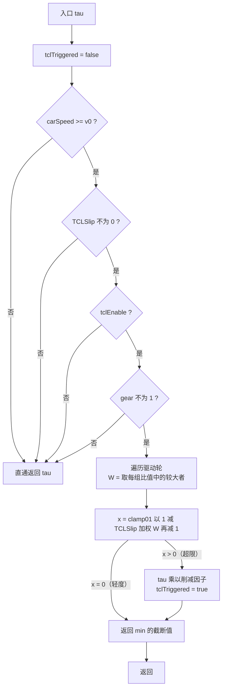

令 $`W`$ 为全部驱动轮上的最大综合滑移指标（纵向与横向取大）：

```math
W \;=\; \max_{\mathrm{driven}}\;
\max\!\left( \left|\frac{\sigma}{s_{\max}}\right|,\;
\left|\frac{\alpha}{\alpha_{\max}}\right| \right)
```

四道门控的语义 [V]：

1. **低速豁免**：$`v_{\mathrm{car}} < v_0`$ 不干预。ctor 序列化默认 1.0 m/s，
   但**运行时真实值为 11.0 m/s**（玩家车 TCdiag 写前值实测，§3.7 注）——
   0~40 km/h 起步段 TC 完全不介入，这正是起步打滑区间的守门人。注意此门
   在读 $`\varepsilon`$ **之前**：只调阈值参数不影响低速段行为；
2. **阈值零值禁用**：$`\varepsilon = 0`$ 时直通（`TCLSlip` 提供了运行时开关语义）；
3. **开关门控**：`tclEnable` 为假不干预（由设置链写入，§3.7）；
4. ~~**一挡豁免**：$`g = 1`$ 时强制直通——起步加速不削油门~~（勘误见下）。

> **勘误（2026-08-28，换挡逻辑反汇编 + 实测）**：门控 4 豁免的**不是一挡而是空挡**。
> `IRDSDrivetrain.gear` 编码为 `{0: R, 1: N, 2: 一挡, 3: 二挡, …}`（UI 显示值 = gear − 1），
> 证据：`ShiftUp`（0x1A6CD88）从 gearWanted==0 升挡要求车速 ≤1 m/s 且增至 2 时触发专用
> 起步事件；`ShiftDown`（0x1A6CF0C）降挡地板为 1 且 gearWanted==2 处有速度特判；
> `changeGearToTarget`（0x1A6CC58）离开 gear==1 有 RPM 阈值检查。实测 TC 在 UI "1 挡"
> 期间活跃（gear=2）。故 TC 实为**全前进挡活跃**，仅空挡豁免。详见 TC_LEVEL_DESIGN.md §2b。

门控全部通过后计算削减因子。以 `s(x)` 记三次 smoothstep（反汇编内联展开，
无子程序调用）[V]：

```math
\mathrm{smoothstep}(x) = 3x^2 - 2x^3, \qquad
x = \mathrm{clamp}_{01}\!\bigl((1-\varepsilon)\,W - 1\bigr)
```

被滤后的油门为：

```math
\mathrm{filtered}(\tau) \;=\;
\min\bigl(\tau\cdot\bigl(1-\mathrm{smoothstep}(x)\bigr),\ 1\bigr),
\qquad \tau < 0 \Rightarrow 0
```

同时 `tclTriggered = true`。注意 $`x > 0`$ 才置位——**触发标记是削减动作的
副产物，而非独立判断** [V]。

## 3.5 执行层：补偿合成与 85% 上限

`carController` 在调用点 +0xBC 处并不直接采用 `TractionFilter` 的返回值，
而是将**被削减量按系数 $`c_T = -0.85`$（`.rodata` @ 0x929E7C）部分回补**后
写入 `actualInputTorque`（0x16C）[V]：

```math
\tau' \;=\; \mathrm{clamp}_{01}\Bigl(\tau + \bigl(\tau - \mathrm{filtered}\bigr)\cdot c_T\Bigr)
\;=\; \tau\cdot\Bigl(1 - 0.85\cdot\mathrm{smoothstep}(x)\Bigr)
```

（推导：$`\mathrm{filtered} \le \tau`$ 恒成立，削减量 $`\Delta = \tau\cdot\mathrm{smoothstep}(x)`$，代入即得。）合成路径中的空挡分支
（$`g = 0`$ 且自动挡时 `actualBrake`/`actualInputTorque` 互换）为挡位细节，
不影响控制律 [V]。

综合决策层与执行层，TC 对油门的**总削减率**（百分比）为：

```math
R(W) \;=\; 85\cdot\mathrm{smoothstep}\bigl(\mathrm{clamp}_{01}((1-\varepsilon)\,W - 1)\bigr)\ \%
```

削减窗口与上限（**运行时实测参数** $`\varepsilon = 0.40`$，§3.7 注）[V]：

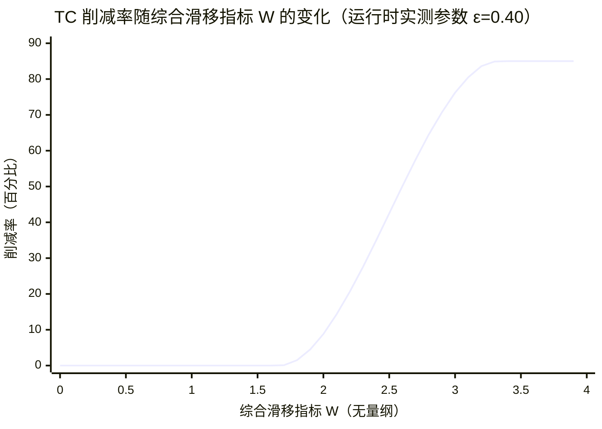

（ctor 序列化默认 $`\varepsilon = 0.45`$ 的曲线形态相同，介入点 1.82 / 饱和点 3.64，窗口整体右移约 9%。）

三个结构特征 [V]：

1. **无干预平台**：$`W \le 1/(1-\varepsilon) \approx 1.67`$（运行时参数；ctor 值下
   为 1.82）时 TC 完全不介入——阈值不是"开始滑移"而是"滑移显著超过归一化峰值"；
2. **85% 上限**：即使轮子完全失控（$`W \to \infty`$），仍保留 15% 油门——
   TC 是**限幅器而非开关**，永远不会把油门清零；
3. **零时间常数**：从感知到执行全程瞬时，无斜坡、无迟滞、无积分器，
   `tclTriggered` 每帧无条件复位后由当帧削减动作重新置位。

## 3.6 输入层：移动端油门斜率调制

TC 在**输入层**还有第二条作用路径（`IRDSPlayerControls.CarControllerMobile`，
移动端专用输入循环）[V]。油门输入状态量以固定斜率积分：

- 上升沿：$`\dot\tau = \Delta t / \mathrm{throttleTime}`$（0x28）；
- 释放沿：以 $`\bar\sigma \ge 0.2`$（`.rodata` @ 0x929D84）为条件切换斜率 [V]：

```math
\dot\tau_{\mathrm{release}} \;=\;
\begin{cases}
1 / \mathrm{throttleReleaseTimeTraction} & \bar\sigma \ge 0.2 \\
1 / \mathrm{throttleReleaseTime} & \bar\sigma < 0.2
\end{cases}
```

即驱动轮平均滑移率超过 0.2 时，松油门的**回落速率切换到专用时间常数**
（0x34）——滑移越严重油门收得越快。这是与 §3.5 的瞬时比例削减互补的
**慢速斜率通道**。`throttleTimeTraction`（0x2C）字段在全 so 范围内无读者，
上升沿斜率不受 TC 影响（§3.11）[V]。

## 3.7 玩家设置链：TC 与 ESC 有效，ABS 断裂的对照

`IRDSPlayerSettings` 的电控字段经 `SetPlayerSettings`（0x1A63788）写入
`IRDSCarControllInput`，映射关系全部经反汇编确认 [V]：

| `IRDSPlayerSettings` 字段（偏移） | 写入目标（偏移） | 默认值（ctor 0x199DD78） | 运行时读者 |
|---|---|---|---|
| `enableABS` (0x50) | `absEnable` (0xC4) | true | **无（死字段）** |
| `abs` (0x54) | `ABSSlip` (0x30) | 0.4 | **无（死字段）** |
| `enableTCL` (0x45) | `tclEnable` (0xC6) | true | `TractionFilter` [V] |
| `tcl` (0x48) | `TCLSlip` (0x34) | 0.45 | `TractionFilter` [V] |
| `tclMinSpd` (0x4C) | `TCLminSPD` (0x38) | 1.0 m/s | `TractionFilter` [V] |
| `enableESC` (0x58) | `escEnable` (0xC5) | true | `escFilter` [V] |
| `esc` (0x5C) | `escFactor` (0x3C) | 1.0 | `escFilter` [V] |
| `enableSteerHelp` (0x60) | `steerHelpEnable` (0xC7) | true | `SteerHelp` [V] |
| `steerHelp` (0x64) | `steerHelp` (0x40) | 0.01 | `SteerHelp` [V] |

值得注意的是 `tcl` 与 `tclMinSpd` 的传值方式：`SetPlayerSettings` 以
**一条 8 字节双字装载指令同时写入两个相邻 float**（`ldr d0` / `stur d0`），
单一 float 偏移扫描会漏报这一传值路径 [V]。

> **运行时实测修正（2026-08-28，模块 TCdiag 写前值日志）**：玩家车进入赛道
> 后 `TractionFilter` 实例读到的实际参数为 $`\varepsilon = 0.40`$、
> $`v_0 = 11.0`$ m/s——**均与 ctor 序列化默认（0.45 / 1.0 m/s）不同**，即
> `SetPlayerSettings` 的调用方传入的值来自车辆/难度配置而非 ctor 常量。
> 该实测与用户体感精确交叉验证：起步 0~40 km/h TC 静默（$`v_0 = 11.0`$ m/s
> 门控）、约 50 km/h 才见首次介入（门控 + $`W`$ 累积）。另经 hook 写入实验
> 证实：**游戏不每帧重写这两个字段**（进赛道写入一次后即保持），任何对
> 它们的覆写都会持续生效直至下次 `SetPlayerSettings`。此二值为本篇公式与
> 削减窗口图的取值依据；ctor 值仅是出厂默认。

由此得到与 §2.7 相反的结论：ESC 与 SteerHelp 的玩家设置链**完整有效**——
`escEnable` 的全文件写入者仅 `SetPlayerSettings` 一处，`steerHelpEnable`
的写入者均为设置应用路径，链终点读者皆为每物理帧活跃的方法 [V]。
ABS 的断裂不是因为这条链不存在，而是因为链的终点（`absEnable`/`ABSSlip`）
的读者 `HandleABS` 本身是死方法。

**TC 的开关位是唯一例外**：`tclEnable` 除 `SetPlayerSettings` 外还有
`TractionControlDynamicAssist` 的三处每帧覆写（§3.10）——玩家设置写入的
值在下一次 Update 中被重算（高速段强制关闭、特定条件下强制开启）。
因此 TC 的参数（$`\varepsilon`$、$`v_0`$）经设置链传递且被 `TractionFilter`
真实读取 [V]，但 `enableTCL` 开关位的最终效果取决于管理器的重算结果，
游戏内设置项能否真正关掉 TC 需实测确认 [?]。

## 3.8 ESC 控制律

`escFilter`（0x1A65090，约 90 条指令）以**车体侧偏角**为判据执行单侧后轮
制动 [V]：

```math
\beta \;=\; 57.29578 \cdot \arctan2\bigl(v_{\mathrm{body},x},\ v_{\mathrm{body},z}\bigr)
\quad [\mathrm{deg}]
```

（换算常数即弧度→角度制；$`v_{\mathrm{body}}`$ = `bodyVelocity`，0x120 [V]。）
触发条件与干预量：

| 条件 | 判据 [V] |
|---|---|
| 使能 | `escEnable` 为真且 $`f_E \ne 0`$ |
| 车速 | $`v_{\mathrm{car}} > 8`$ m/s（低速豁免） |
| 触发 | $`\beta > +3^\circ`$ 或 $`\beta < -3^\circ`$ |
| 干预 | $`\mathrm{brake} = \min\bigl(f_E,\ 2000/\rho\bigr)`$ 写入单侧后轮 0xF0 |
| 方向 | $`\beta > 0`$ → 右后轮（`wheelRR`，0xB4）；$`\beta < 0`$ → 左后轮（`wheelRL`，0xB0） |
| 标记 | `escTriggered`（0xC9）置位 |

即：侧偏角超过 3° 时对**同侧后轮**施加制动，制动量由玩家设置强度 $`f_E`$
决定、以 $`2000/\rho`$ 为上限（$`2000`$ 为 `.rodata` 立即数 0x44FA0000）[V]。
单侧后轮制动产生反向横摆力矩，是道路车辆 ESC 的经典执行方式。

## 3.9 转向辅助

`SteerHelp(steer)`（0x1A64E28，约 160 条指令）是三者中最复杂的过滤器，
在转向输入上叠加两级修正 [V]：

1. **速度钳制**（`steerHelp = 0` 时仍生效的基础路径）：以
   $`\mathrm{clamp}_{01}(v_{\mathrm{car}}\cdot 3.6 / 700)`$（km/h 归一化）
   计算速度相关转向钳制系数并写入 `clampFactor`（0xCC）；
2. **侧偏反馈**（`steerHelp > 0` 且玩家车且 $`g \ne 0`$）：以全部轮子的
   `unitSlip`/`unitAngle`（0x3F8/0x3FC）均值为基底，当
   $`|\beta| > 1^\circ`$、横向速度为正且 $`v_{\mathrm{car}} > 3`$ m/s 时，
   按 $`\beta / (2\,\delta_{\max})`$（$`\delta_{\max}`$ = `maxSteerLock`，0xA0）
   反打方向，经 `.rodata` 步长常数（±0.01 / ±0.1）限幅 [V]。

输出写入 `clampFactor`（0xCC）并**回写共享字段 `driftAngle`（0x70）**——
与 `escFilter` 的读取形成管线内前后依赖：SteerHelp 先算 $`\beta`$，
escFilter 后用它做触发判据 [V]。

## 3.10 玩家车的 TCL 每帧重算器

`carModifier.TractionControlDynamicAssist`（0x176935C）的调用点位于
`carModifier.Update`（+0xAC）内 `playercar`（0x9C）门控之后——**仅对玩家车
每帧执行，AI 车辆不经过此函数** [V]。它对玩家车的 `tclEnable` 做三步重算 [V]：

1. **无条件先开**：每帧写入 `tclEnable = true`；
2. **条件关闭 A**：当（全局设置单例开关为真、其子对象整型字段 = 1、
   且玩家不在维修区 `intw._onPits` (0x21) = false）时写 false——
   单例谓词语义未解 [?]；
3. **条件关闭 B（高速禁用）**：玩家在赛道上（`PlayerGotOutOfTrack` 为假）且
   刚体速度模长 > 22 m/s（约 79 km/h，`.rodata` 立即数）且不在维修区时写 false。

~~即 TC 的实际生效区间被管理器限制为**低速段**：车速超过约 79 km/h 后即使
门控位活跃，`tclEnable` 也被每帧拉低，`TractionFilter` 的所有逻辑不再执行~~
（勘误见下：该分支实为维修区限速处理，正常赛道 TC 全速域活跃）。

该函数后半段混入与 TC 无关的**赛道状态逻辑**
（`PlayerGotOutOfTrack` → `odometerHandler.InvalidateLap` 圈速无效化 →
`IRDSCarControllerAI.OnPlayerRejoinTrack`），方法名与实际职责不对应，
属引擎的历史演化痕迹 [V]。

> **勘误（2026-08-28，实测 + 反汇编复核）**：本节"实际生效区间 ≈ 3.6–79 km/h"
> 的结论**过度普遍化**。指令级复核（libil2cpp.so 0x176935C–0x17696FC）表明：
> 高速关闭块被 `CheckTrackLimitRespected()`（0x17695A8）与第二 singleton 的
> 首字节双重门控，且块内调用 `setBrakeInput(1.0)`/`setThrottleInput(0.0)`
>（22 m/s ≈ 79 km/h，即 F1 维修区 80 km/h 限速）——该分支实为**维修区限速
> 处理**，并非全局 TC 截止。条件 A/B 的 singleton 谓词在正常赛道行驶下
> 实测未生效（玩家 100–130 km/h 仍观察到 TC 削油门），即**正常赛道 tclEnable
> 恒为 true，TC 全速域活跃**。步骤①每帧无条件写 true 亦使游戏内 TC 开关位
> （enableTCL）无法关闭 TC，游戏侧唯一关闭路径是下拉框把 `tcl` 写 0
>（触发 TractionFilter 门控 2）。详见 TC_LEVEL_DESIGN.md §2b。

## 3.11 僵尸代码与死字段

与 ABS 篇的判定方法一致（全文件调用图重建 + 字段访问扫描）[V]：

| 死项 | 证据 |
|---|---|
| `IRDSPlayerControls.tractionControl`（0x38，bool） | 类内全方法零读者 |
| `IRDSPlayerControls.throttleTimeTraction`（0x2C） | 全文件零读者（仅访问器） |
| `GetTCLSlip`/`SetTCLSlip`（0x1A62BCC/0x1A62BD4） | 全文件零调用者 |
| `GetTCLMinSPD`/`SetTCLMinSPD`（0x1A62BEC/0x1A62BF4） | 全文件零调用者 |
| `GetThrottleTimeTraction` 等访问器 | 仅被序列化/外部工具链路径引用，物理不经过 |

注意与 ABS 篇的层级对照：**车辆级**（`IRDSCarControllInput`）TC 是活的；
死掉的是**输入层** `IRDSPlayerControls` 中的一组 TC 字段——移动端真正的
释放斜率开关直接比较 $`\bar\sigma \ge 0.2`$（§3.6），绕过了这组字段 [V]。

## 3.12 特性总结：驱动侧与制动侧电控的对称性

TC（驱动侧）与 ABS（制动侧）在架构上互为镜像，但成熟度相反 [V]：

| 维度 | ABS（§2） | TC（§3） |
|---|---|---|
| 车辆级执行层 | 死代码（`HandleABS` 无调用者） | 活代码（每物理帧执行） |
| 真实执行体 | 轮级 `RoadForce` 方波脉冲 | 车辆级 `TractionFilter` 比例削减 |
| 削减形态 | 25 Hz 两态方波（间歇泄压） | 连续 smoothstep（3 次多项式） |
| 削减上限 | 制动压力可降至 0 | 油门残量恒 15% |
| 阈值语义 | 硬编码 0.15，与轮胎模型解耦 | 参数化 $`\varepsilon`$（运行时实测 0.40，ctor 0.45），经归一化窗口 |
| 玩家设置链 | 断裂（终点死字段） | 参数传递有效；开关位被每帧重算（§3.10） |
| 低速行为 | 与打滑无关的强限压（辅助过度主力） | $`v_0`$（运行时 11.0 m/s）以下与空挡豁免；赛道上全速域活跃（"79 关闭"为维修区逻辑，§3.10 勘误） |
| 时间特性 | 每帧翻转、无状态 | 零时间常数、瞬时比例 |

TC 的设计质量显著高于 ABS：参数化阈值、单调平滑削减、有界干预量、
瞬时无迟滞，且低速/起步策略合理。两者共用同一感知层（$`\sigma`$ 均出自
`RoadForce`），差异源于执行层级的历史保留状态——ABS 的车辆级路径
被轮级实现取代后沦为死代码，TC 的车辆级路径则被保留并接入了玩家设置链 [V]。

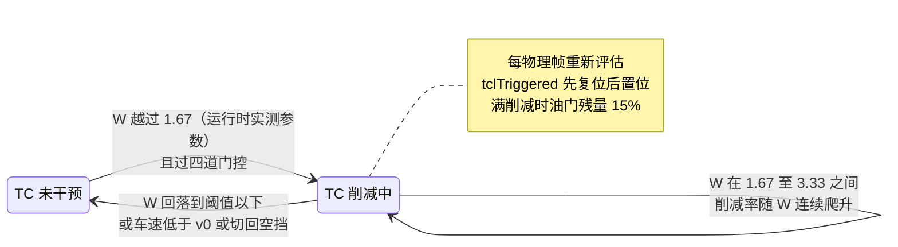

> **本篇结论**：Ala Mobile 的 TC 是一个**阈值触发的瞬时比例控制器**——
> 以驱动轮滑移率/侧偏角的归一化最大值为判据，经 smoothstep 插值削减油门，
> 上限 85%、无时间常数、空挡与低速（运行时 $`v_0 = 11.0`$ m/s，即 0~40 km/h
> 起步段）豁免，**赛道上全速域活跃、无介入速度上限**（"79 km/h 高速关闭"
> 实为维修区限速辅助，赛道上不生效，§3.10 勘误）。其参数链传递有效且
> **运行时真实参数与 ctor 默认不同**
> （$`\varepsilon = 0.40`$ / $`v_0 = 11.0`$ m/s，实测见 §3.7 注），开关位被
> 每帧重算，游戏内设置能否关掉 TC 需实测。ESC 以 3° 侧偏角为判据做单侧
> 后轮制动，转向辅助在转向通道上叠加速度钳制与侧偏反馈。
> ESC/SteerHelp 的玩家设置链完整有效，与 ABS 的断裂形成对照。三者共享
> `carController` 管线与轮级感知字段，构成该游戏驾驶辅助的电控中枢。

# 传动与多线程轮子物理（待补充）

> **占位篇目**——本篇将覆盖 `IRDSDrivetrain`（引擎扭矩计算、换挡、离合、涡轮）
> 与 `multithreadWheelManager` 的 Jobs System 轮子物理管线
> （`BuildRaycastCommandsJob` / `GenerateAllWheelRaysJob` / `ComputeAveragedHitsJob`），
> 以及轮子物理与主线程（`RoadForce` 等）的同步边界。

---

# 附录

## 附录 A：ABS 篇证据置信度矩阵

| 发现 | 置信度 | 证据来源 |
|---|---|---|
| `HandleABS` / `ApplyDiffLockABS` 为死方法 | [V] | 全文件 bl/b 解码扫描 0 命中 + proxy hook 无日志 |
| `carController` 不含 ABS 逻辑 | [V] | 反汇编全文检索 |
| `FixedUpdate` 尾跳 `carController` | [V] | `b 0x1A645CC` |
| `RoadForce` 是 ABS 唯一执行体 | [V] | `usesABS`/`pulseBrakes`/`kP`/速度因子/阈值全部在此访问 |
| `usesABS` 为唯一 per-wheel 门控 | [V] | 全文件扫描：仅 `SettingsChanged` 写、`RoadForce` 读 |
| `usesABS=false` 且 `playercar` → 跳过 ABS | [V] | 反汇编分支 + 实测禁用生效 |
| 滑移阈值 0.15 硬编码 | [V] | `.rodata` 0x929A54 $`= -0.15`$ |
| `pulseBrakes` 每帧翻转（25 Hz 方波） | [V] | `eor w8, w8, #1` + `strb` |
| pulse 相位 $`\times b`$ | [V] | 反汇编分支 |
| $`k_P \equiv 0`$ | [V] | 全文件无写入 |
| 速度因子 $`\alpha_v = \mathrm{clamp}(\lVert v\rVert/13.89)`$ | [V] | ctor 默认 13.89 / 0 |
| 压力上限两段插值 | [V] | `F_base = p_0 + (2r−r²)(T_b−p_0)` |
| $`\sigma`$ 为归一化滑动速度 | [V] | `SlipRatio` 反汇编 |
| $`s_{\max}`$ 仅用于视觉/声音 | [V] | 全文件读者扫描 |
| 玩家设置链断裂 | [V] | `acceptNewValues → SetPlayerSettings →` 死字段 |
| `abs` 默认值 0.4 | [V] | `IRDSPlayerSettings..ctor`（0x3ECCCCCD） |
| `SettingsChanged` 触发时机 | [V] | 唯一调用者 `IRDSWheel$$Awake`（0x1A7A008）——装车写一次，运行时永不重写（2026-08-28 写入者全 so 扫描） |
| $`b`$、`legacyLowBrakePressure*` 实际值 | [V] | SetBrakeBiasValues 计算：$`b=0`$（bias=60）、$`p_0 = 780/520`$（bias×13）；ABSdiag 实测逐位吻合（2026-08-28） |
| 80（限压分母）的单位 | [?] | m/s 假设（Rigidbody.velocity 原始单位） |
| ~~HandleABS 被内联至 carController~~ | [X] | carController 反汇编无 ABS 逻辑；HandleABS 有完整方法体、无调用者 |
| ~~ABSSlip 为滑移率阈值~~ | [X] | 系（死设计中的）容差因子，且无读者 |
| ~~阈值定义于 Pacejka 峰值附近（动态）~~ | [X] | 真实阈值硬编码 0.15，与轮胎曲线解耦 |
| ~~`brakeReducerMultiplier` 渐进控制~~ | [X] | 死字段 |
| ~~速度区间线性渐进启用 ABS~~ | [X] | 修正为 $`\alpha_v`$ 门控（0 / 13.89）与另一路压力限值 |

## 附录 B：ABS 篇关键常数与地址表

| 名称 | 值 / 地址 | 出处 |
|---|---|---|
| 滑移阈值 | $`0.15`$（`.rodata` @ 0x929A54，存储为 $`-0.15`$） | [V] |
| 滑移归一化斜率 $`c`$ | 0.02（`.rodata` @ 0x929B70） | [V] |
| 偏置归一化除数 | 0.3（`.rodata` @ 0x929EAC） | [V] |
| `fullAbsEnableSpeed` | 13.89 m/s（0x415E3D71，ctor @ 0x1A7DCA8） | [V] |
| `lowAbsDisableSpeed` | 0（无写入者） | [V] |
| `tempRearBrakeBalancerSpeed` | 80.0（ctor） | [V] |
| 死设计车速门槛 | 15.0 m/s（`HandleABS` 内硬编码） | [V，死代码] |
| `IRDSPlayerSettings.abs` 默认值 | 0.4（ctor @ 0x199DD78） | [V] |
| 压力平滑常数 | 0.15（`.rodata` @ 0x9297B4） | [V] |
| 角度→弧度 | $`\pi/180`$（`.rodata` @ 0x929A14） | [V] |

## 附录 C：TC/ESC 篇证据置信度矩阵

| 发现 | 置信度 | 证据来源 |
|---|---|---|
| `carController` 串联 `TractionFilter`/`SteerHelp`/`escFilter` | [V] | 调用点偏移 +0xBC/+0x470/+0x5BC，全文件 bl 解码 |
| `TractionFilter` 四道门控（$`v_0`$/$`\varepsilon`$/$`t`$/一挡） | [V] | 反汇编分支链 0x1A64CE4 起 |
| 综合滑移指标 $`W = \max(\|\sigma/s_{\max}\|, \|\alpha/\alpha_{\max}\|)`$ | [V] | 驱动轮循环 `fdiv`/`fabs`/`fcsel gt` 序列 |
| 削减因子 `smoothstep`（3x²−2x³ 内联展开） | [V] | `fmov #3`/`fadd`/`fmul` 立即数序列 |
| 补偿系数 $`c_T = -0.85`$ | [V] | `.rodata` @ 0x929E7C（0xBF59999A） |
| 满削减残量 15% | [V] | 由 $`c_T`$ 代数导出 + 反汇编无其他路径 |
| `tclTriggered` 为削减副产物（先复位后置位） | [V] | `strb wzr` @ +0x14 与 `strb #1` @ +0x120 |
| `SlipRatio` 公式与 $`K = 0.02`$ | [V] | 反汇编 + `.rodata` @ 0x929B70 |
| `SlipRatio` 的 `radius` 参数未使用 | [V] | 加载后立即被覆盖 |
| 分母随 $`\Delta t`$ 缩放（`Time.fixedDeltaTime` 调用） | [V] | script.json 桩解析 0x32A5D34 |
| $`\bar\sigma`$ 为驱动轮加权聚合 | [V] | `IRDSDrivetrain.FixedUpdate` 循环累加 |
| 移动端释放斜率阈值 $`\bar\sigma \ge 0.2`$ | [V] | `.rodata` @ 0x929D84 + `CarControllerMobile` 分支 |
| TC/ESC/SteerHelp 设置链完整有效 | 修正 | ESC/SteerHelp：唯一写入者 `SetPlayerSettings`，读者活跃 [V]；`tclEnable` 另有 3 处每帧覆写（§3.10），`enableTCL` 开关最终效果 [?] |
| `TractionControlDynamicAssist` 仅玩家车执行 | [V] | 调用点前 `playercar` (0x9C) 门控，AI 车跳过 |
| $`tcl`$/$`tclMinSpd`$ 双字传递（单 float 扫描漏报） | [V] | `ldr d0`/`stur d0` @ 0x1A637B0 |
| `tcl`/`tclMinSpd`/`esc`/`steerHelp` 默认值 0.45/1.0/1.0/0.01 | [V] | ctor @ 0x199DD78 + `.rodata` @ 0x92A778 |
| 运行时真实参数 $`\varepsilon = 0.40`$ / $`v_0 = 11.0`$ m/s（≠ctor 默认） | [V] | 模块 TCdiag 写前值日志（2026-08-28 实机）+ 50 km/h 体感交叉验证 |
| 游戏**不每帧重写** `TCLSlip`/`TCLminSPD`（进赛道写一次后保持） | [V] | TCdiag 写前值恒等于上帧写入值（2026-08-28 实机） |
| `TractionFilter` 门控①（$`v_0`$）在读 $`\varepsilon`$ 之前 | [V] | `TractionFilter` 反汇编 0x1A64CE8-0x1A64CFC：0x38 fcmp/b.mi 先于 0x34 ldr |
| ESC 单侧后轮制动（$`\beta > 3^\circ`$，$`v > 8`$ m/s） | [V] | `escFilter` 反汇编全文 |
| $`\beta`$ 为角度制（57.29578 换算） | [V] | `.rodata` @ 0x929EB0 |
| ESC 制动量 $`\min(f_E, 2000/\rho)`$ | [V] | `.rodata` 立即数 0x44FA0000 = 2000 |
| SteerHelp 速度钳制 + 侧偏反馈两级结构 | [V] | 反汇编主路径 |
| SteerHelp 与 escFilter 共享 `driftAngle` 写/读 | [V] | 同偏移 0x70 的 str/ldr 顺序 |
| AI 车 TCL 条件剥夺 + 圈速逻辑混入 | [V] | `TractionControlDynamicAssist` 反汇编全文 |
| `tractionControl`/`throttleTimeTraction`/TC 访问器为死代码 | [V] | 全文件调用图 + 字段访问扫描 |
| $`\sigma`$、$`\alpha`$、`unitSlip`/`unitAngle` 的序列化实际值 | [?] | Unity 资产，静态不可得 |
| $`W`$ 阈值 1.67 / 3.33（运行时参数）的物理单位（滑移比 or 绝对滑移率） | [?] | 取决于 $`s_{\max}`$ 运行时值（序列化） |
| 非移动端（手柄/键盘）路径是否同样调释放斜率切换 | [?] | 仅确认 `CarControllerMobile`（移动端），桌面路径未逐指令验证 |
| ~~TC 车辆级层与 ABS 一样存在设置链断裂~~ | [X] | 读者 `TractionFilter` 为活方法，占位篇导语之疑已证伪 |
| ~~`TractionControlDynamicAssist` 是 TC 的强度调节器~~ | [X] | 实际为 AI 车开关管理 + 圈速无效化混合体 |
| ~~`escFilter` 制动量与侧偏角成正比~~ | [X] | 制动量 = `min(escFactor, 2000/ρ)`，与 $`\beta`$ 无关（$`\beta`$ 仅触发） |

## 附录 D：TC/ESC 篇关键常数与地址表

| 名称 | 值 / 地址 | 出处 |
|---|---|---|
| TC 补偿系数 $`c_T`$ | −0.85（`.rodata` @ 0x929E7C） | [V] |
| TC 阈值参数 $`\varepsilon`$（`tcl`） | 0.45（ctor @ 0x199DD78，`.rodata` @ 0x92A778 双字低半）；**运行时实测 0.40**（TCdiag 写前值） | [V] |
| TC 最低车速 $`v_0`$（`tclMinSpd`） | 1.0 m/s（ctor，`.rodata` @ 0x92A780 双字高半）；**运行时实测 11.0 m/s**（TCdiag 写前值） | [V] |
| `SlipRatio` 归一化常数 $`K`$ | 0.02（`.rodata` @ 0x929B70） | [V] |
| `SlipRatio` 饱和速度（默认帧率） | 8 m/s（`8·\Delta t/K`，$`\Delta t`$ = 0.02） | [V] |
| 移动端释放斜率切换阈值 | 0.2（`.rodata` @ 0x929D84，$`\bar\sigma`$） | [V] |
| ESC 侧偏角触发阈 | ±3°（`fmov #3.0` 立即数） | [V] |
| ESC 侧偏角换算 | 57.29578（`.rodata` @ 0x929EB0，弧度→度） | [V] |
| ESC 车速下限 | 8 m/s（`fmov #8.0` 立即数） | [V] |
| ESC 制动上限分子 | 2000.0（立即数 0x44FA0000） | [V] |
| SteerHelp 强度默认值 | 0.01（ctor，0x3C23D70A） | [V] |
| SteerHelp 速度归一化 | 3.6 / 700（`.rodata` @ 0x929E8C / 立即数 0x442F0000） | [V] |
| SteerHelp 步长常数 | ±0.01 / ±0.1（`.rodata` @ 0x929A64/0x929D40/0x9299C4/0x929D90） | [V] |
| `IRDSPlayerSettings` ctor | 0x199DD78 | [V] |
| `SetPlayerSettings` | 0x1A63788 | [V] |
| `TractionFilter` | 0x1A64CE4 | [V] |
| `escFilter` | 0x1A65090 | [V] |
| `SteerHelp` | 0x1A64E28 | [V] |
| `TractionControlDynamicAssist` | 0x176935C（调用者 `carModifier.Update`+0xAC） | [V] |
| `IRDSWheel.SlipRatio` | 0x1A7B244（调用者 `RoadForce`+0x71C） | [V] |
| `carController` 内 TC 调用点 | +0xBC（0x1A64688） | [V] |
| `IRDSDrivetrain.FixedUpdate` 聚合写入点 | +0x548 / +0x638（0xCC） | [V] |